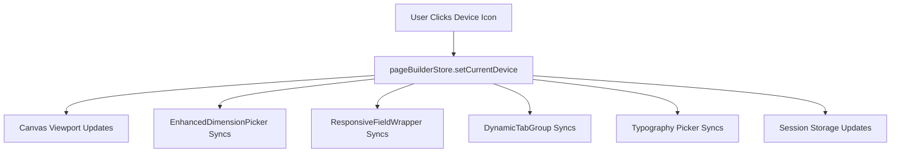

# Unified Responsive Device System Documentation

## Overview

The Laravel Page Builder features a comprehensive unified responsive device system that enables seamless editing across desktop, tablet, and mobile viewports. This system provides a single source of truth for device state management, ensuring all responsive controls synchronize automatically.

## Architecture

### Core Components

#### 1. **Centralized State Management** (`pageBuilderStore.js`)
```javascript
// Global device state
currentDevice: 'desktop', // Current active device
canvasViewport: {
  desktop: '100%',    // Full width for desktop
  tablet: '768px',    // Fixed width for tablet preview
  mobile: '375px'     // Fixed width for mobile preview
},
deviceBreakpoints: {
  desktop: { min: 1025, label: 'Desktop (1025px+)' },
  tablet: { min: 769, max: 1024, label: 'Tablet (769px - 1024px)' },
  mobile: { max: 768, label: 'Mobile (≤768px)' }
}
```

#### 2. **Device Management Actions**
- `setCurrentDevice(device)` - Updates global device state
- `getCurrentViewport()` - Returns current device viewport width
- `getDeviceLabel()` - Returns formatted device label
- `initializeDeviceFromStorage()` - Restores device from session storage

### Visual Components

#### **Canvas System** (`Canvas.jsx`)
- **Responsive Viewport**: Automatically adjusts canvas width based on selected device
- **Device Frames**: Visual browser-like frames for tablet/mobile preview
- **Device Indicators**: Labels showing current device and viewport dimensions
- **Smooth Transitions**: CSS transitions for seamless device switching

#### **Toolbar Integration** (`CanvasToolbar.jsx`)
- **Device Icons**: Desktop, tablet, mobile selection buttons
- **Visual Feedback**: Active device highlighting
- **Persistence**: Remembers device selection across sessions

## Integrated Components

### 1. **EnhancedDimensionPicker**
- **Auto-sync**: Spacing, padding, margin controls sync with toolbar
- **Global State**: Replaced local `activeBreakpoint` with global `currentDevice`
- **Unified UX**: Device selection in picker updates entire interface

### 2. **ResponsiveFieldWrapper**
- **Universal Wrapper**: Adds responsive controls to any field
- **Device Detection**: Automatically shows current device on load
- **Consistent UI**: Standardized device switching interface

### 3. **DynamicTabGroup** (Conditional Integration)
- **Smart Detection**: Automatically detects responsive vs feature tabs
- **Conditional Logic**:
  ```javascript
  const isResponsiveTabGroup = tabKeys.length === 3 &&
    tabKeys.includes('desktop') &&
    tabKeys.includes('tablet') &&
    tabKeys.includes('mobile');
  ```
- **Dual Mode**: Global device state for responsive tabs, local state for others

### 4. **EnhancedTypographyPicker**
- **Defensive Programming**: Null-safe property access patterns
- **Enhanced Validation**: Comprehensive structure validation
- **Error Prevention**: Early return for invalid states

## How It Works

### Device Selection Flow

1. **User Clicks Device Icon** in toolbar (desktop/tablet/mobile)
2. **Global State Updates** via `setCurrentDevice()`
3. **Canvas Viewport Changes** to match device width
4. **All Responsive Controls Sync** automatically
5. **Session Storage Updates** for persistence

### Component Synchronization



### Smart Component Detection

Components use conditional logic to determine device state usage:

```javascript
// Example: DynamicTabGroup responsive detection
const tabKeys = Object.keys(tabs);
const isResponsiveTabGroup = tabKeys.length === 3 &&
  tabKeys.includes('desktop') &&
  tabKeys.includes('tablet') &&
  tabKeys.includes('mobile');

// Use global state for responsive tabs, local for feature tabs
const activeTab = isResponsiveTabGroup ? currentDevice : localActiveTab;
```

## CSS Integration

### Responsive CSS Generation

The system generates device-specific CSS using breakpoints:

```css
/* Desktop (default) */
.pb-section-123 { padding: 20px 15px; }

/* Tablet */
@media (max-width: 1024px) {
  .pb-section-123 { padding: 15px 10px; }
}

/* Mobile */
@media (max-width: 768px) {
  .pb-section-123 { padding: 10px 5px; }
}
```

### Canvas Visual Effects

```css
/* Device frame for tablet/mobile */
.device-frame {
  border: 2px solid #d1d5db;
  border-radius: 12px;
  box-shadow: 0 20px 25px -5px rgba(0, 0, 0, 0.1);
  background: #f9fafb;
  padding: 8px;
}

/* Smooth transitions */
.canvas-container {
  transition: max-width 0.3s ease-in-out;
}
```

## Data Structure

### Responsive Value Format

```javascript
// Simple responsive value
const spacing = {
  desktop: { top: 20, right: 15, bottom: 20, left: 15, unit: 'px' },
  tablet: { top: 15, right: 10, bottom: 15, left: 10, unit: 'px' },
  mobile: { top: 10, right: 5, bottom: 10, left: 5, unit: 'px' }
};

// Typography responsive value
const typography = {
  desktop: {
    font_size: { value: 18, unit: 'px' },
    line_height: { value: 1.5, unit: 'em' }
  },
  tablet: {
    font_size: { value: 16, unit: 'px' },
    line_height: { value: 1.4, unit: 'em' }
  },
  mobile: {
    font_size: { value: 14, unit: 'px' },
    line_height: { value: 1.3, unit: 'em' }
  }
};
```

## User Experience

### Workflow Benefits

1. **Single Device Selection**: Choose once, everything syncs
2. **Visual Consistency**: All responsive controls show same device
3. **Professional Feel**: Smooth transitions and visual feedback
4. **Workflow Efficiency**: No repetitive device selection
5. **Error Prevention**: Unified state eliminates conflicts

### Visual Feedback

- **Active Device Highlighting**: Selected device icon highlighted
- **Device Labels**: Clear indication of current device and viewport
- **Canvas Frames**: Browser-like frames for tablet/mobile preview
- **Smooth Animations**: Professional transitions between devices

## Developer Guide

### Adding Responsive Support to Components

1. **Import Store Hook**:
```javascript
import { usePageBuilderStore } from '@/Store/pageBuilderStore';
```

2. **Connect to Global State**:
```javascript
const { currentDevice, setCurrentDevice } = usePageBuilderStore();
```

3. **Use Global Device State**:
```javascript
// Replace local device state
const activeDevice = currentDevice;
const setActiveDevice = setCurrentDevice;
```

4. **Handle Responsive Data**:
```javascript
const getDeviceValue = (responsiveValue) => {
  if (typeof responsiveValue === 'object' && responsiveValue[currentDevice]) {
    return responsiveValue[currentDevice];
  }
  return responsiveValue;
};
```

### Best Practices

1. **Always use global device state** for responsive components
2. **Implement defensive programming** with null-safe access
3. **Provide fallback values** for missing responsive data
4. **Use conditional integration** for mixed-purpose components
5. **Test across all device modes** during development

## Troubleshooting

### Common Issues

1. **Component not syncing**: Ensure it's connected to global device state
2. **CSS not applying**: Check responsive CSS generation in SectionLayoutCSSGenerator
3. **Crashes on device switch**: Add defensive checks for undefined properties
4. **Session not persisting**: Verify sessionStorage is accessible

### Debug Tools

```javascript
// Check current device state
console.log('Current Device:', usePageBuilderStore.getState().currentDevice);

// Verify device synchronization
console.log('All responsive states synced:', {
  store: currentDevice,
  canvas: /* canvas device */,
  fields: /* field device */
});
```

## Migration Guide

### Upgrading Existing Components

1. **Remove local device state**:
```javascript
// Before
const [activeDevice, setActiveDevice] = useState('desktop');

// After
const { currentDevice, setCurrentDevice } = usePageBuilderStore();
```

2. **Update device handlers**:
```javascript
// Before
onClick={() => setActiveDevice('tablet')}

// After
onClick={() => setCurrentDevice('tablet')}
```

3. **Add defensive checks**:
```javascript
// Before
value={data.spacing.value}

// After
value={data?.spacing?.value ?? 0}
```

## Performance Considerations

- **Session Storage**: Minimal overhead for device persistence
- **CSS Transitions**: Hardware accelerated for smooth animations
- **Component Re-renders**: Optimized with React.memo where appropriate
- **State Updates**: Batched updates prevent unnecessary re-renders

## Future Enhancements

- **Custom Breakpoints**: User-defined responsive breakpoints
- **Device Templates**: Predefined device-specific settings
- **Responsive Preview**: Live preview of all devices simultaneously
- **Export Options**: Device-specific CSS export functionality

---

*This documentation covers the unified responsive device system implemented in the Laravel Page Builder. For implementation details, refer to the source code in the respective component files.*