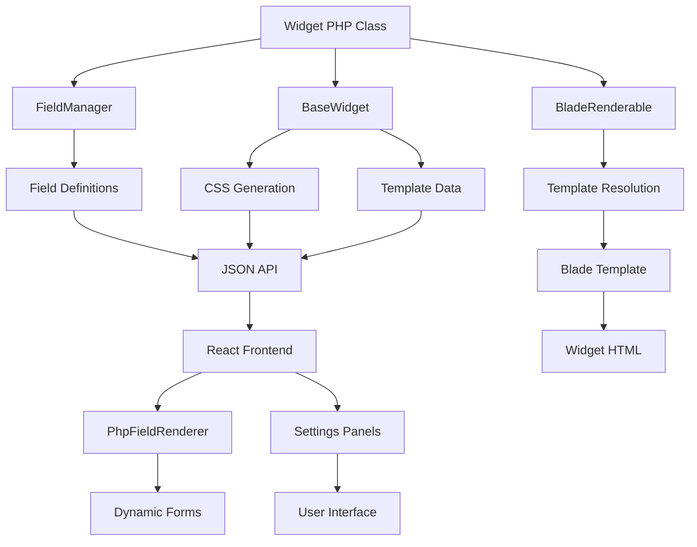

# Developer Architecture Guide

## Overview

This guide provides comprehensive documentation for developers working with the PageBuilder system, covering the PHP-React widget loading architecture, dynamic content management, and the integration between backend field definitions and frontend rendering.

## Table of Contents

1. [System Architecture Overview](#system-architecture-overview)
2. [PHP-React Widget Loading System](#php-react-widget-loading-system)
3. [Dynamic Content and Settings Loading](#dynamic-content-and-settings-loading)
4. [Field Definition and Rendering Pipeline](#field-definition-and-rendering-pipeline)
5. [Widget Registration and Discovery](#widget-registration-and-discovery)
6. [Template Resolution System](#template-resolution-system)
7. [State Management Architecture](#state-management-architecture)
8. [API Integration Patterns](#api-integration-patterns)
9. [Error Handling and Debugging](#error-handling-and-debugging)

## System Architecture Overview

### High-Level Architecture Flow

```
┌─────────────────┐    ┌─────────────────┐    ┌─────────────────┐
│   PHP Backend   │    │   API Layer     │    │ React Frontend  │
│                 │    │                 │    │                 │
│ - Widget Class  │◄──►│ - Field API     │◄──►│ - PhpFieldRenderer
│ - Field Manager │    │ - Preview API   │    │ - Settings Panel│
│ - Template      │    │ - CSS API       │    │ - Canvas        │
└─────────────────┘    └─────────────────┘    └─────────────────┘
        │                       │                       │
        ▼                       ▼                       ▼
┌─────────────────┐    ┌─────────────────┐    ┌─────────────────┐
│ Blade Templates │    │ JSON Responses  │    │ Dynamic Renders │
│ - Widget HTML   │    │ - Field Configs │    │ - Live Updates  │
│ - CSS Classes   │    │ - Settings Data │    │ - State Sync    │
└─────────────────┘    └─────────────────┘    └─────────────────┘
```

### Core Components Interaction



## PHP-React Widget Loading System

### Widget Discovery Process

The system uses a multi-step discovery process to load and render widgets:

#### 1. PHP Widget Registration

```php
// plugins/Pagebuilder/WidgetLoader.php
class WidgetLoader
{
    private static array $registeredWidgets = [];

    public static function loadWidgets(): void
    {
        // Auto-discovery of widget classes
        $widgetPaths = [
            app_path('Plugins/Pagebuilder/Widgets/Basic/'),
            app_path('Plugins/Pagebuilder/Widgets/Advanced/'),
            app_path('Plugins/Pagebuilder/Widgets/Custom/')
        ];

        foreach ($widgetPaths as $path) {
            $widgets = self::discoverWidgets($path);
            foreach ($widgets as $widget) {
                self::registerWidget($widget);
            }
        }
    }

    private static function discoverWidgets(string $path): array
    {
        $widgets = [];

        if (!is_dir($path)) {
            return $widgets;
        }

        $files = glob($path . '*Widget.php');

        foreach ($files as $file) {
            $className = self::getClassNameFromFile($file);

            if (class_exists($className) && is_subclass_of($className, BaseWidget::class)) {
                $widgets[] = $className;
            }
        }

        return $widgets;
    }

    public static function registerWidget(string $widgetClass): void
    {
        $widget = new $widgetClass();
        $type = $widget->getWidgetType();

        self::$registeredWidgets[$type] = [
            'class' => $widgetClass,
            'instance' => $widget,
            'metadata' => [
                'name' => $widget->getWidgetName(),
                'icon' => $widget->getWidgetIcon(),
                'description' => $widget->getWidgetDescription(),
                'category' => $widget->getCategory(),
                'keywords' => $widget->getKeywords(),
                'version' => $widget->getVersion()
            ]
        ];
    }

    public static function getWidget(string $type): ?BaseWidget
    {
        return self::$registeredWidgets[$type]['instance'] ?? null;
    }

    public static function getAllWidgets(): array
    {
        return array_map(function ($widget) {
            return array_merge(
                ['type' => $widget['instance']->getWidgetType()],
                $widget['metadata']
            );
        }, self::$registeredWidgets);
    }
}
```

#### 2. React Widget Type Resolution

```javascript
// resources/js/Components/PageBuilder/Widgets/WidgetRenderer.jsx
import { lazy, Suspense } from 'react';
import PhpWidgetRenderer from './PhpWidgetRenderer';

// Dynamic import map for React-specific widgets
const reactWidgetComponents = {
    'advanced_form': lazy(() => import('./Types/AdvancedFormWidget')),
    'interactive_map': lazy(() => import('./Types/InteractiveMapWidget')),
    'dynamic_chart': lazy(() => import('./Types/DynamicChartWidget'))
};

const WidgetRenderer = ({ widget, settings, isSelected, onUpdate, onDelete }) => {
    const widgetType = widget.type;

    // Check if widget has dedicated React component
    if (reactWidgetComponents[widgetType]) {
        const ReactComponent = reactWidgetComponents[widgetType];

        return (
            <Suspense fallback={<div className="widget-loading">Loading widget...</div>}>
                <ReactComponent
                    widget={widget}
                    settings={settings}
                    isSelected={isSelected}
                    onUpdate={onUpdate}
                    onDelete={onDelete}
                />
            </Suspense>
        );
    }

    // Default to PHP rendering for all other widgets
    return (
        <PhpWidgetRenderer
            widget={widget}
            settings={settings}
            isSelected={isSelected}
            onUpdate={onUpdate}
            onDelete={onDelete}
        />
    );
};

export default WidgetRenderer;
```

#### 3. PHP Widget Rendering System

```javascript
// resources/js/Components/PageBuilder/Widgets/PhpWidgetRenderer.jsx
import { useState, useEffect } from 'react';
import { widgetAPI } from '../../../Services/widgetAPI';

const PhpWidgetRenderer = ({ widget, settings, isSelected, onUpdate, onDelete }) => {
    const [renderedHTML, setRenderedHTML] = useState('');
    const [loading, setLoading] = useState(true);
    const [error, setError] = useState(null);

    useEffect(() => {
        renderWidget();
    }, [widget.type, settings]);

    const renderWidget = async () => {
        try {
            setLoading(true);
            setError(null);

            const response = await widgetAPI.preview(widget.type, {
                settings: settings || {},
                widgetId: widget.id,
                instanceId: widget.instanceId
            });

            if (response.success) {
                setRenderedHTML(response.html);
            } else {
                throw new Error(response.error || 'Failed to render widget');
            }
        } catch (err) {
            console.error(`Failed to render ${widget.type} widget:`, err);
            setError(err.message);
            setRenderedHTML(getErrorHTML(widget.type, err.message));
        } finally {
            setLoading(false);
        }
    };

    const getErrorHTML = (widgetType, errorMessage) => {
        return `
            <div class="widget-error">
                <div class="widget-error-icon">⚠️</div>
                <div class="widget-error-content">
                    <h4>Widget Rendering Error</h4>
                    <p><strong>Widget:</strong> ${widgetType}</p>
                    <p><strong>Error:</strong> ${errorMessage}</p>
                    <button onclick="window.location.reload()" class="widget-error-retry">
                        Retry
                    </button>
                </div>
            </div>
        `;
    };

    const wrapperClasses = [
        'widget-wrapper',
        `widget-${widget.type}`,
        isSelected ? 'widget-selected' : '',
        loading ? 'widget-loading' : '',
        error ? 'widget-error-state' : ''
    ].filter(Boolean).join(' ');

    const wrapperStyles = {
        position: 'relative',
        minHeight: loading ? '100px' : 'auto'
    };

    return (
        <div className={wrapperClasses} style={wrapperStyles}>
            {/* Widget Controls Overlay */}
            {isSelected && (
                <div className="widget-controls">
                    <button
                        className="widget-control widget-control-edit"
                        onClick={() => onUpdate?.(widget)}
                        title="Edit Widget"
                    >
                        ✏️
                    </button>
                    <button
                        className="widget-control widget-control-delete"
                        onClick={() => onDelete?.(widget.id)}
                        title="Delete Widget"
                    >
                        🗑️
                    </button>
                </div>
            )}

            {/* Loading State */}
            {loading && (
                <div className="widget-loading-overlay">
                    <div className="widget-spinner"></div>
                    <span>Rendering {widget.type}...</span>
                </div>
            )}

            {/* Rendered Widget Content */}
            <div
                className="widget-content"
                dangerouslySetInnerHTML={{ __html: renderedHTML }}
                style={{ opacity: loading ? 0.5 : 1 }}
            />
        </div>
    );
};

export default PhpWidgetRenderer;
```

## Dynamic Content and Settings Loading

### Settings Loading Pipeline

The system implements a sophisticated settings loading pipeline that handles dynamic content, validation, and state management:

#### 1. Initial Settings Resolution

```javascript
// resources/js/Store/pageBuilderStore.js
import { create } from 'zustand';
import { subscribeWithSelector } from 'zustand/middleware';

const usePageBuilderStore = create(
    subscribeWithSelector((set, get) => ({
        // Widget states
        widgets: new Map(),
        widgetSettings: new Map(),
        widgetDefaults: new Map(),

        // Loading states
        loadingWidgets: new Set(),
        settingsCache: new Map(),

        // Methods
        loadWidgetSettings: async (widgetId, widgetType) => {
            const state = get();

            // Check cache first
            const cacheKey = `${widgetType}_defaults`;
            if (state.settingsCache.has(cacheKey)) {
                const cachedDefaults = state.settingsCache.get(cacheKey);
                set(state => ({
                    widgetDefaults: new Map(state.widgetDefaults.set(widgetId, cachedDefaults))
                }));
                return cachedDefaults;
            }

            // Load from API
            try {
                const response = await widgetAPI.getFields(widgetType);
                const defaults = extractDefaultValues(response.fields);

                // Cache the defaults
                set(state => ({
                    settingsCache: new Map(state.settingsCache.set(cacheKey, defaults)),
                    widgetDefaults: new Map(state.widgetDefaults.set(widgetId, defaults))
                }));

                return defaults;
            } catch (error) {
                console.error(`Failed to load settings for ${widgetType}:`, error);
                return {};
            }
        },

        updateWidgetSetting: (widgetId, settingKey, value) => {
            set(state => {
                const currentSettings = state.widgetSettings.get(widgetId) || {};
                const updatedSettings = {
                    ...currentSettings,
                    [settingKey]: value
                };

                return {
                    widgetSettings: new Map(state.widgetSettings.set(widgetId, updatedSettings))
                };
            });

            // Trigger re-render for PHP widgets
            get().triggerWidgetRender(widgetId);
        },

        triggerWidgetRender: (widgetId) => {
            const state = get();
            const widget = state.widgets.get(widgetId);

            if (widget && widget.renderType === 'php') {
                // Add to render queue for batched updates
                state.queueWidgetRender(widgetId);
            }
        }
    }))
);

// Helper function to extract default values from field definitions
function extractDefaultValues(fields) {
    const defaults = {};

    Object.entries(fields).forEach(([groupKey, group]) => {
        if (group.type === 'group' && group.fields) {
            Object.entries(group.fields).forEach(([fieldKey, field]) => {
                if (field.default !== undefined) {
                    defaults[fieldKey] = field.default;
                }
            });
        } else if (group.default !== undefined) {
            defaults[groupKey] = group.default;
        }
    });

    return defaults;
}
```

#### 2. Real-time Settings Synchronization

```javascript
// resources/js/Hooks/useWidgetSettings.js
import { useEffect, useCallback } from 'react';
import { usePageBuilderStore } from '../Store/pageBuilderStore';
import { debounce } from 'lodash';

export const useWidgetSettings = (widgetId, widgetType) => {
    const {
        widgetSettings,
        widgetDefaults,
        loadWidgetSettings,
        updateWidgetSetting
    } = usePageBuilderStore();

    // Get current settings with fallbacks
    const settings = {
        ...(widgetDefaults.get(widgetId) || {}),
        ...(widgetSettings.get(widgetId) || {})
    };

    // Load default settings on mount
    useEffect(() => {
        if (!widgetDefaults.has(widgetId)) {
            loadWidgetSettings(widgetId, widgetType);
        }
    }, [widgetId, widgetType]);

    // Debounced update function
    const debouncedUpdate = useCallback(
        debounce((key, value) => {
            updateWidgetSetting(widgetId, key, value);
        }, 300),
        [widgetId, updateWidgetSetting]
    );

    // Update setting function
    const updateSetting = useCallback((key, value) => {
        // Immediate local update for UI responsiveness
        const currentSettings = widgetSettings.get(widgetId) || {};
        const newSettings = { ...currentSettings, [key]: value };

        // Update store immediately
        updateWidgetSetting(widgetId, key, value);

        // Trigger debounced backend sync
        debouncedUpdate(key, value);
    }, [widgetId, debouncedUpdate, widgetSettings, updateWidgetSetting]);

    // Batch update function
    const updateSettings = useCallback((newSettings) => {
        Object.entries(newSettings).forEach(([key, value]) => {
            updateSetting(key, value);
        });
    }, [updateSetting]);

    return {
        settings,
        updateSetting,
        updateSettings,
        isLoading: !widgetDefaults.has(widgetId)
    };
};
```

#### 3. Dynamic Content Loading

```javascript
// resources/js/Services/dynamicContentLoader.js
class DynamicContentLoader {
    constructor() {
        this.cache = new Map();
        this.loadingPromises = new Map();
    }

    async loadDynamicContent(widgetType, contentType, params = {}) {
        const cacheKey = this.getCacheKey(widgetType, contentType, params);

        // Return cached content if available
        if (this.cache.has(cacheKey)) {
            const cached = this.cache.get(cacheKey);
            if (this.isValidCache(cached)) {
                return cached.data;
            } else {
                this.cache.delete(cacheKey);
            }
        }

        // Return existing loading promise to avoid duplicate requests
        if (this.loadingPromises.has(cacheKey)) {
            return this.loadingPromises.get(cacheKey);
        }

        // Create new loading promise
        const loadingPromise = this.fetchContent(widgetType, contentType, params)
            .then(data => {
                // Cache the result
                this.cache.set(cacheKey, {
                    data,
                    timestamp: Date.now(),
                    ttl: 5 * 60 * 1000 // 5 minutes
                });

                // Remove from loading promises
                this.loadingPromises.delete(cacheKey);

                return data;
            })
            .catch(error => {
                // Remove from loading promises on error
                this.loadingPromises.delete(cacheKey);
                throw error;
            });

        this.loadingPromises.set(cacheKey, loadingPromise);
        return loadingPromise;
    }

    async fetchContent(widgetType, contentType, params) {
        const response = await fetch('/api/pagebuilder/dynamic-content', {
            method: 'POST',
            headers: {
                'Content-Type': 'application/json',
                'X-CSRF-TOKEN': document.querySelector('meta[name="csrf-token"]').content
            },
            body: JSON.stringify({
                widget_type: widgetType,
                content_type: contentType,
                params
            })
        });

        if (!response.ok) {
            throw new Error(`HTTP error! status: ${response.status}`);
        }

        const data = await response.json();

        if (!data.success) {
            throw new Error(data.error || 'Failed to load dynamic content');
        }

        return data.content;
    }

    getCacheKey(widgetType, contentType, params) {
        return `${widgetType}:${contentType}:${JSON.stringify(params)}`;
    }

    isValidCache(cached) {
        return Date.now() - cached.timestamp < cached.ttl;
    }

    clearCache(pattern = null) {
        if (pattern) {
            for (const [key] of this.cache) {
                if (key.includes(pattern)) {
                    this.cache.delete(key);
                }
            }
        } else {
            this.cache.clear();
        }
    }
}

export const dynamicContentLoader = new DynamicContentLoader();
```

## Field Definition and Rendering Pipeline

### Field Definition Architecture

The field definition system uses a sophisticated pipeline that transforms PHP field definitions into React components:

#### 1. PHP Field Definition Structure

```php
// plugins/Pagebuilder/Core/FieldManager.php
class FieldManager
{
    public static function TEXT(): TextField
    {
        return new TextField();
    }

    public static function COLOR(): ColorField
    {
        return new ColorField();
    }

    public static function SELECT(): SelectField
    {
        return new SelectField();
    }

    // Pre-built field groups
    public static function TYPOGRAPHY_GROUP(): TypographyFieldGroup
    {
        return new TypographyFieldGroup();
    }

    public static function BACKGROUND_GROUP(): BackgroundFieldGroup
    {
        return new BackgroundFieldGroup();
    }

    public static function SPACING_GROUP(): SpacingFieldGroup
    {
        return new SpacingFieldGroup();
    }
}

// Base field class
abstract class BaseField
{
    protected string $type;
    protected string $label;
    protected mixed $default;
    protected array $conditions = [];
    protected array $selectors = [];
    protected string $description = '';
    protected bool $required = false;
    protected bool $responsive = false;

    public function setLabel(string $label): static
    {
        $this->label = $label;
        return $this;
    }

    public function setDefault(mixed $default): static
    {
        $this->default = $default;
        return $this;
    }

    public function setCondition(array $condition): static
    {
        $this->conditions = $condition;
        return $this;
    }

    public function setSelectors(array $selectors): static
    {
        $this->selectors = $selectors;
        return $this;
    }

    public function setResponsive(bool $responsive = true): static
    {
        $this->responsive = $responsive;
        return $this;
    }

    public function toArray(): array
    {
        return [
            'type' => $this->type,
            'label' => $this->label,
            'default' => $this->default,
            'conditions' => $this->conditions,
            'selectors' => $this->selectors,
            'description' => $this->description,
            'required' => $this->required,
            'responsive' => $this->responsive,
            ...$this->getFieldSpecificData()
        ];
    }

    abstract protected function getFieldSpecificData(): array;
}

// Specific field implementations
class TextField extends BaseField
{
    protected string $type = 'text';
    protected string $placeholder = '';
    protected ?int $maxLength = null;
    protected string $inputType = 'text';

    public function setPlaceholder(string $placeholder): static
    {
        $this->placeholder = $placeholder;
        return $this;
    }

    public function setMaxLength(int $maxLength): static
    {
        $this->maxLength = $maxLength;
        return $this;
    }

    public function asEmail(): static
    {
        $this->inputType = 'email';
        return $this;
    }

    public function asUrl(): static
    {
        $this->inputType = 'url';
        return $this;
    }

    protected function getFieldSpecificData(): array
    {
        return [
            'placeholder' => $this->placeholder,
            'maxLength' => $this->maxLength,
            'inputType' => $this->inputType
        ];
    }
}

class ColorField extends BaseField
{
    protected string $type = 'color';
    protected bool $showAlpha = false;
    protected array $palette = [];
    protected string $format = 'hex';

    public function setShowAlpha(bool $showAlpha = true): static
    {
        $this->showAlpha = $showAlpha;
        return $this;
    }

    public function setPalette(array $palette): static
    {
        $this->palette = $palette;
        return $this;
    }

    public function asRgba(): static
    {
        $this->format = 'rgba';
        $this->showAlpha = true;
        return $this;
    }

    protected function getFieldSpecificData(): array
    {
        return [
            'showAlpha' => $this->showAlpha,
            'palette' => $this->palette,
            'format' => $this->format
        ];
    }
}
```

#### 2. Field Group Management

```php
// plugins/Pagebuilder/Core/ControlManager.php
class ControlManager
{
    private array $groups = [];
    private ?string $currentGroup = null;

    public function addGroup(string $key, string $label): static
    {
        $this->groups[$key] = [
            'type' => 'group',
            'label' => $label,
            'fields' => []
        ];
        $this->currentGroup = $key;
        return $this;
    }

    public function registerField(string $key, BaseField $field): static
    {
        if (!$this->currentGroup) {
            throw new RuntimeException('No group defined. Call addGroup() first.');
        }

        $this->groups[$this->currentGroup]['fields'][$key] = $field->toArray();
        return $this;
    }

    public function endGroup(): static
    {
        $this->currentGroup = null;
        return $this;
    }

    public function getFields(): array
    {
        return $this->groups;
    }

    // Pre-built field groups for consistency
    public function addTypographyGroup(string $key = 'typography', string $label = 'Typography'): static
    {
        $this->addGroup($key, $label)
            ->registerField('font_family', FieldManager::SELECT()
                ->setLabel('Font Family')
                ->setOptions([
                    'inherit' => 'Default',
                    'Arial, sans-serif' => 'Arial',
                    'Georgia, serif' => 'Georgia',
                    'Times, serif' => 'Times New Roman',
                    'Verdana, sans-serif' => 'Verdana'
                ])
                ->setDefault('inherit')
            )
            ->registerField('font_size', FieldManager::RESPONSIVE_NUMBER()
                ->setLabel('Font Size')
                ->setDefault(['desktop' => '16px', 'tablet' => '15px', 'mobile' => '14px'])
                ->setUnits(['px', 'em', 'rem', '%'])
                ->setMin(8)
                ->setMax(100)
            )
            ->registerField('font_weight', FieldManager::SELECT()
                ->setLabel('Font Weight')
                ->setOptions([
                    '300' => 'Light',
                    '400' => 'Regular',
                    '500' => 'Medium',
                    '600' => 'Semi Bold',
                    '700' => 'Bold'
                ])
                ->setDefault('400')
            )
            ->registerField('line_height', FieldManager::NUMBER()
                ->setLabel('Line Height')
                ->setMin(0.5)
                ->setMax(3)
                ->setStep(0.1)
                ->setDefault(1.5)
            )
            ->registerField('letter_spacing', FieldManager::NUMBER()
                ->setLabel('Letter Spacing')
                ->setMin(-5)
                ->setMax(5)
                ->setStep(0.1)
                ->setDefault(0)
                ->setUnit('px')
            )
            ->registerField('text_transform', FieldManager::SELECT()
                ->setLabel('Text Transform')
                ->setOptions([
                    'none' => 'None',
                    'uppercase' => 'UPPERCASE',
                    'lowercase' => 'lowercase',
                    'capitalize' => 'Capitalize'
                ])
                ->setDefault('none')
            )
            ->endGroup();

        return $this;
    }

    public function addBackgroundGroup(string $key = 'background', string $label = 'Background'): static
    {
        $this->addGroup($key, $label)
            ->registerField('background_type', FieldManager::SELECT()
                ->setLabel('Background Type')
                ->setOptions([
                    'none' => 'None',
                    'color' => 'Color',
                    'gradient' => 'Gradient',
                    'image' => 'Image'
                ])
                ->setDefault('none')
            )
            ->registerField('background_color', FieldManager::COLOR()
                ->setLabel('Background Color')
                ->setDefault('#ffffff')
                ->setCondition(['background_type' => ['color', 'gradient']])
            )
            ->registerField('background_gradient', FieldManager::GRADIENT()
                ->setLabel('Gradient')
                ->setCondition(['background_type' => 'gradient'])
                ->setDefault([
                    'type' => 'linear',
                    'angle' => 135,
                    'colorStops' => [
                        ['color' => '#667EEA', 'position' => 0],
                        ['color' => '#764BA2', 'position' => 100]
                    ]
                ])
            )
            ->registerField('background_image', FieldManager::MEDIA()
                ->setLabel('Background Image')
                ->setCondition(['background_type' => 'image'])
                ->setMediaType('image')
            )
            ->registerField('background_size', FieldManager::SELECT()
                ->setLabel('Background Size')
                ->setOptions([
                    'auto' => 'Auto',
                    'cover' => 'Cover',
                    'contain' => 'Contain'
                ])
                ->setDefault('cover')
                ->setCondition(['background_type' => 'image'])
            )
            ->registerField('background_position', FieldManager::SELECT()
                ->setLabel('Background Position')
                ->setOptions([
                    'center center' => 'Center Center',
                    'center top' => 'Center Top',
                    'center bottom' => 'Center Bottom',
                    'left center' => 'Left Center',
                    'right center' => 'Right Center'
                ])
                ->setDefault('center center')
                ->setCondition(['background_type' => 'image'])
            )
            ->endGroup();

        return $this;
    }
}
```

#### 3. React Field Rendering System

```javascript
// resources/js/Components/PageBuilder/Fields/PhpFieldRenderer.jsx
import React from 'react';
import TextFieldComponent from './TextFieldComponent';
import ColorFieldComponent from './ColorFieldComponent';
import SelectFieldComponent from './SelectFieldComponent';
import ToggleFieldComponent from './ToggleFieldComponent';
import NumberFieldComponent from './NumberFieldComponent';
import TextareaFieldComponent from './TextareaFieldComponent';
import EnhancedBackgroundPicker from './EnhancedBackgroundPicker';
import EnhancedDimensionPicker from './EnhancedDimensionPicker';
import ResponsiveFieldWrapper from './ResponsiveFieldWrapper';

const PhpFieldRenderer = ({ fieldKey, fieldConfig, value, onChange, deviceType = 'desktop' }) => {
    // Validate required props
    if (!fieldConfig) {
        console.error(`PhpFieldRenderer: fieldConfig is required for field "${fieldKey}"`);
        return <div className="field-error">Field configuration missing for "{fieldKey}"</div>;
    }

    // Handle conditional field display
    if (fieldConfig.conditions && !evaluateConditions(fieldConfig.conditions, value)) {
        return null;
    }

    // Prepare common props
    const commonProps = {
        fieldKey,
        fieldConfig,
        value: value !== undefined ? value : fieldConfig.default,
        onChange,
        deviceType
    };

    // Handle responsive fields
    if (fieldConfig.responsive && fieldConfig.type !== 'group') {
        return (
            <ResponsiveFieldWrapper
                label={fieldConfig.label}
                value={value}
                onChange={onChange}
                defaultValue={fieldConfig.default}
                description={fieldConfig.description}
            >
                {renderFieldType(fieldConfig.type, commonProps)}
            </ResponsiveFieldWrapper>
        );
    }

    // Handle field groups
    if (fieldConfig.type === 'group') {
        return renderFieldGroup(fieldKey, fieldConfig, value, onChange);
    }

    // Render individual field
    return renderFieldType(fieldConfig.type, commonProps);
};

// Field type renderer
function renderFieldType(type, props) {
    switch (type) {
        case 'text':
            return <TextFieldComponent {...props} />;

        case 'color':
            return <ColorFieldComponent {...props} />;

        case 'select':
            return <SelectFieldComponent {...props} />;

        case 'toggle':
            return <ToggleFieldComponent {...props} />;

        case 'number':
            return <NumberFieldComponent {...props} />;

        case 'textarea':
            return <TextareaFieldComponent {...props} />;

        case 'background_group':
            return <EnhancedBackgroundPicker {...props} />;

        case 'spacing':
            return <EnhancedDimensionPicker {...props} />;

        case 'gradient':
            return renderGradientField(props);

        case 'media':
            return renderMediaField(props);

        case 'icon':
            return renderIconField(props);

        case 'enhanced_link':
            return renderEnhancedLinkField(props);

        case 'alignment':
            return renderAlignmentField(props);

        case 'divider':
            return renderDividerField(props);

        default:
            console.warn(`PhpFieldRenderer: Unknown field type "${type}"`);
            return (
                <div className="field-error">
                    <p>Unknown field type: <code>{type}</code></p>
                    <p>Field key: <code>{props.fieldKey}</code></p>
                </div>
            );
    }
}

// Field group renderer
function renderFieldGroup(groupKey, groupConfig, value, onChange) {
    const { label, fields, description } = groupConfig;
    const groupValue = value || {};

    const handleFieldChange = (fieldKey, fieldValue) => {
        const updatedGroup = {
            ...groupValue,
            [fieldKey]: fieldValue
        };
        onChange(updatedGroup);
    };

    return (
        <div className="field-group">
            <h3 className="field-group-title">{label}</h3>
            {description && <p className="field-group-description">{description}</p>}

            <div className="field-group-content">
                {Object.entries(fields).map(([fieldKey, fieldConfig]) => (
                    <PhpFieldRenderer
                        key={fieldKey}
                        fieldKey={fieldKey}
                        fieldConfig={fieldConfig}
                        value={groupValue[fieldKey]}
                        onChange={(value) => handleFieldChange(fieldKey, value)}
                    />
                ))}
            </div>
        </div>
    );
}

// Condition evaluation helper
function evaluateConditions(conditions, currentValues) {
    return Object.entries(conditions).every(([key, expectedValue]) => {
        const currentValue = currentValues?.[key];

        if (Array.isArray(expectedValue)) {
            // Handle array conditions (e.g., ['!=', 'none'])
            if (expectedValue.length === 2) {
                const [operator, compareValue] = expectedValue;
                switch (operator) {
                    case '!=':
                    case 'not_equal':
                        return currentValue !== compareValue;
                    case '==':
                    case 'equal':
                        return currentValue === compareValue;
                    case '>':
                        return currentValue > compareValue;
                    case '<':
                        return currentValue < compareValue;
                    case 'in':
                        return Array.isArray(compareValue) && compareValue.includes(currentValue);
                    default:
                        return expectedValue.includes(currentValue);
                }
            } else {
                // Handle array of possible values
                return expectedValue.includes(currentValue);
            }
        }

        if (typeof expectedValue === 'boolean') {
            return Boolean(currentValue) === expectedValue;
        }

        return currentValue === expectedValue;
    });
}

export default PhpFieldRenderer;
```

## Widget Registration and Discovery

### Automatic Widget Discovery

The system uses an automatic discovery mechanism to find and register widget classes:

#### 1. File System Scanner

```php
// plugins/Pagebuilder/Core/WidgetScanner.php
class WidgetScanner
{
    private array $scanPaths = [];
    private array $excludePatterns = [];

    public function __construct()
    {
        $this->scanPaths = [
            app_path('Plugins/Pagebuilder/Widgets/Basic/'),
            app_path('Plugins/Pagebuilder/Widgets/Advanced/'),
            app_path('Plugins/Pagebuilder/Widgets/Custom/'),
            app_path('Plugins/Pagebuilder/Widgets/ThirdParty/')
        ];

        $this->excludePatterns = [
            'Abstract*',
            'Base*',
            '*Test.php',
            '*Interface.php',
            '*Trait.php'
        ];
    }

    public function scanForWidgets(): array
    {
        $widgets = [];

        foreach ($this->scanPaths as $path) {
            if (!is_dir($path)) {
                continue;
            }

            $found = $this->scanDirectory($path);
            $widgets = array_merge($widgets, $found);
        }

        return array_unique($widgets);
    }

    private function scanDirectory(string $path): array
    {
        $widgets = [];
        $iterator = new RecursiveIteratorIterator(
            new RecursiveDirectoryIterator($path, RecursiveDirectoryIterator::SKIP_DOTS)
        );

        foreach ($iterator as $file) {
            if ($file->getExtension() !== 'php') {
                continue;
            }

            $relativePath = $iterator->getSubPathName();

            // Skip excluded patterns
            if ($this->shouldExcludeFile($relativePath)) {
                continue;
            }

            $className = $this->extractClassName($file->getPathname());

            if ($className && $this->isValidWidget($className)) {
                $widgets[] = $className;
            }
        }

        return $widgets;
    }

    private function shouldExcludeFile(string $relativePath): bool
    {
        foreach ($this->excludePatterns as $pattern) {
            if (fnmatch($pattern, basename($relativePath))) {
                return true;
            }
        }

        return false;
    }

    private function extractClassName(string $filePath): ?string
    {
        $content = file_get_contents($filePath);

        // Extract namespace
        preg_match('/namespace\s+([^;]+);/', $content, $namespaceMatches);
        $namespace = $namespaceMatches[1] ?? '';

        // Extract class name
        preg_match('/class\s+(\w+)(?:\s+extends\s+\w+)?/', $content, $classMatches);
        $className = $classMatches[1] ?? null;

        if (!$className) {
            return null;
        }

        return $namespace ? "{$namespace}\\{$className}" : $className;
    }

    private function isValidWidget(string $className): bool
    {
        if (!class_exists($className)) {
            return false;
        }

        $reflection = new ReflectionClass($className);

        // Must extend BaseWidget
        if (!$reflection->isSubclassOf(BaseWidget::class)) {
            return false;
        }

        // Must not be abstract
        if ($reflection->isAbstract()) {
            return false;
        }

        // Must implement required methods
        $requiredMethods = ['getWidgetType', 'getWidgetName', 'render'];
        foreach ($requiredMethods as $method) {
            if (!$reflection->hasMethod($method)) {
                return false;
            }
        }

        return true;
    }
}
```

#### 2. Widget Registry System

```php
// plugins/Pagebuilder/Core/WidgetRegistry.php
class WidgetRegistry
{
    private static ?self $instance = null;
    private array $widgets = [];
    private array $categories = [];
    private bool $loaded = false;

    public static function getInstance(): self
    {
        if (self::$instance === null) {
            self::$instance = new self();
        }

        return self::$instance;
    }

    public function loadWidgets(): void
    {
        if ($this->loaded) {
            return;
        }

        $scanner = new WidgetScanner();
        $widgetClasses = $scanner->scanForWidgets();

        foreach ($widgetClasses as $widgetClass) {
            $this->registerWidget($widgetClass);
        }

        $this->loaded = true;

        // Fire loaded event
        event('pagebuilder.widgets.loaded', [$this->widgets]);
    }

    public function registerWidget(string $widgetClass): void
    {
        try {
            $widget = new $widgetClass();
            $type = $widget->getWidgetType();

            // Validate widget type uniqueness
            if (isset($this->widgets[$type])) {
                throw new RuntimeException("Widget type '{$type}' is already registered");
            }

            $this->widgets[$type] = [
                'class' => $widgetClass,
                'instance' => $widget,
                'metadata' => $this->extractMetadata($widget),
                'capabilities' => $this->extractCapabilities($widget),
                'version' => $this->getWidgetVersion($widget),
                'dependencies' => $this->getWidgetDependencies($widget)
            ];

            // Register category
            $category = $widget->getCategory();
            if (!in_array($category, $this->categories)) {
                $this->categories[] = $category;
            }

            Log::debug("Registered widget: {$type} ({$widgetClass})");

        } catch (Exception $e) {
            Log::error("Failed to register widget {$widgetClass}: " . $e->getMessage());
            throw $e;
        }
    }

    public function getWidget(string $type): ?BaseWidget
    {
        if (!$this->loaded) {
            $this->loadWidgets();
        }

        return $this->widgets[$type]['instance'] ?? null;
    }

    public function getAllWidgets(): array
    {
        if (!$this->loaded) {
            $this->loadWidgets();
        }

        return array_map(function ($widget) {
            return [
                'type' => $widget['instance']->getWidgetType(),
                ...$widget['metadata'],
                'capabilities' => $widget['capabilities'],
                'version' => $widget['version'],
                'dependencies' => $widget['dependencies']
            ];
        }, $this->widgets);
    }

    public function getWidgetsByCategory(string $category): array
    {
        $allWidgets = $this->getAllWidgets();

        return array_filter($allWidgets, function ($widget) use ($category) {
            return $widget['category'] === $category;
        });
    }

    public function hasWidget(string $type): bool
    {
        if (!$this->loaded) {
            $this->loadWidgets();
        }

        return isset($this->widgets[$type]);
    }

    public function unregisterWidget(string $type): bool
    {
        if (!$this->hasWidget($type)) {
            return false;
        }

        unset($this->widgets[$type]);
        Log::debug("Unregistered widget: {$type}");
        return true;
    }

    private function extractMetadata(BaseWidget $widget): array
    {
        return [
            'name' => $widget->getWidgetName(),
            'icon' => $widget->getWidgetIcon(),
            'description' => $widget->getWidgetDescription(),
            'category' => $widget->getCategory(),
            'keywords' => method_exists($widget, 'getKeywords') ? $widget->getKeywords() : [],
            'author' => method_exists($widget, 'getAuthor') ? $widget->getAuthor() : 'Unknown'
        ];
    }

    private function extractCapabilities(BaseWidget $widget): array
    {
        $capabilities = [];

        // Check for responsive support
        if (method_exists($widget, 'supportsResponsive') && $widget->supportsResponsive()) {
            $capabilities[] = 'responsive';
        }

        // Check for dynamic content
        if (method_exists($widget, 'supportsDynamicContent') && $widget->supportsDynamicContent()) {
            $capabilities[] = 'dynamic_content';
        }

        // Check for advanced styling
        if (method_exists($widget, 'supportsAdvancedStyling') && $widget->supportsAdvancedStyling()) {
            $capabilities[] = 'advanced_styling';
        }

        // Check for custom CSS
        if (method_exists($widget, 'supportsCustomCSS') && $widget->supportsCustomCSS()) {
            $capabilities[] = 'custom_css';
        }

        return $capabilities;
    }

    private function getWidgetVersion(BaseWidget $widget): string
    {
        if (method_exists($widget, 'getVersion')) {
            return $widget->getVersion();
        }

        return '1.0.0';
    }

    private function getWidgetDependencies(BaseWidget $widget): array
    {
        if (method_exists($widget, 'getDependencies')) {
            return $widget->getDependencies();
        }

        return [];
    }
}
```

## Template Resolution System

### Blade Template Discovery

The template resolution system provides flexible template discovery with fallback mechanisms:

#### 1. Template Resolver

```php
// plugins/Pagebuilder/Core/TemplateResolver.php
class TemplateResolver
{
    private array $templatePaths = [];
    private array $templateCache = [];

    public function __construct()
    {
        $this->templatePaths = [
            // Theme-specific templates (highest priority)
            resource_path('views/pagebuilder/widgets/'),

            // Custom templates
            resource_path('views/widgets/'),

            // Default widget templates
            base_path('plugins/Pagebuilder/Templates/'),

            // Fallback templates (lowest priority)
            base_path('plugins/Pagebuilder/Templates/Fallbacks/')
        ];
    }

    public function resolveTemplate(string $widgetType, array $data = []): array
    {
        $cacheKey = "template_{$widgetType}";

        if (isset($this->templateCache[$cacheKey])) {
            return $this->templateCache[$cacheKey];
        }

        $templateInfo = $this->findTemplate($widgetType);
        $this->templateCache[$cacheKey] = $templateInfo;

        return $templateInfo;
    }

    private function findTemplate(string $widgetType): array
    {
        $possibleNames = [
            $widgetType,
            str_replace('_', '-', $widgetType),
            Str::kebab($widgetType),
            'widget-' . $widgetType
        ];

        foreach ($this->templatePaths as $basePath) {
            foreach ($possibleNames as $templateName) {
                $templatePath = "{$basePath}{$templateName}.blade.php";

                if (file_exists($templatePath)) {
                    return [
                        'path' => $templatePath,
                        'name' => $templateName,
                        'view' => $this->pathToViewName($templatePath),
                        'type' => $this->getTemplateType($basePath),
                        'priority' => $this->getTemplatePriority($basePath)
                    ];
                }
            }
        }

        // Return fallback template info
        return $this->getFallbackTemplate($widgetType);
    }

    private function pathToViewName(string $path): string
    {
        $viewsPath = resource_path('views');

        if (str_starts_with($path, $viewsPath)) {
            $relativePath = substr($path, strlen($viewsPath) + 1);
            return str_replace(['/', '.blade.php'], ['.', ''], $relativePath);
        }

        // For non-standard paths, create a unique view name
        return 'pagebuilder.widgets.' . basename($path, '.blade.php');
    }

    private function getTemplateType(string $basePath): string
    {
        if (str_contains($basePath, 'pagebuilder/widgets')) {
            return 'theme';
        } elseif (str_contains($basePath, 'Templates/Fallbacks')) {
            return 'fallback';
        } elseif (str_contains($basePath, 'Templates')) {
            return 'default';
        }

        return 'custom';
    }

    private function getTemplatePriority(string $basePath): int
    {
        if (str_contains($basePath, 'pagebuilder/widgets')) {
            return 100; // Theme templates (highest priority)
        } elseif (str_contains($basePath, 'views/widgets')) {
            return 80; // Custom templates
        } elseif (str_contains($basePath, 'Templates/') && !str_contains($basePath, 'Fallbacks')) {
            return 60; // Default templates
        }

        return 40; // Fallback templates (lowest priority)
    }

    private function getFallbackTemplate(string $widgetType): array
    {
        return [
            'path' => base_path('plugins/Pagebuilder/Templates/Fallbacks/default.blade.php'),
            'name' => 'default',
            'view' => 'pagebuilder.fallback.default',
            'type' => 'fallback',
            'priority' => 0,
            'original_widget' => $widgetType
        ];
    }

    public function clearTemplateCache(): void
    {
        $this->templateCache = [];
    }

    public function addTemplatePath(string $path, int $priority = 50): void
    {
        // Insert path at appropriate position based on priority
        $inserted = false;

        foreach ($this->templatePaths as $index => $existingPath) {
            if ($this->getTemplatePriority($existingPath) < $priority) {
                array_splice($this->templatePaths, $index, 0, [$path]);
                $inserted = true;
                break;
            }
        }

        if (!$inserted) {
            $this->templatePaths[] = $path;
        }

        $this->clearTemplateCache();
    }
}
```

#### 2. BladeRenderable Trait

```php
// plugins/Pagebuilder/Core/BladeRenderable.php
trait BladeRenderable
{
    private ?TemplateResolver $templateResolver = null;

    protected function getTemplateResolver(): TemplateResolver
    {
        if ($this->templateResolver === null) {
            $this->templateResolver = new TemplateResolver();
        }

        return $this->templateResolver;
    }

    public function hasBladeTemplate(): bool
    {
        $templateInfo = $this->getTemplateResolver()->resolveTemplate($this->getWidgetType());
        return $templateInfo['type'] !== 'fallback' || file_exists($templateInfo['path']);
    }

    public function renderBladeTemplate(string $templateName = null, array $data = []): string
    {
        $widgetType = $templateName ?? $this->getWidgetType();
        $templateInfo = $this->getTemplateResolver()->resolveTemplate($widgetType);

        try {
            // Prepare template data
            $templateData = array_merge($this->getDefaultTemplateData(), $data);

            // Add template metadata
            $templateData['_template'] = $templateInfo;
            $templateData['_widget'] = [
                'type' => $this->getWidgetType(),
                'name' => $this->getWidgetName(),
                'version' => method_exists($this, 'getVersion') ? $this->getVersion() : '1.0.0'
            ];

            // Render the template
            $html = view($templateInfo['view'], $templateData)->render();

            // Post-process the HTML
            return $this->postProcessHtml($html, $templateData);

        } catch (Exception $e) {
            Log::error("Template rendering failed for {$this->getWidgetType()}: " . $e->getMessage());
            return $this->renderErrorTemplate($e, $templateInfo, $data);
        }
    }

    protected function getDefaultTemplateData(): array
    {
        return [
            'widgetType' => $this->getWidgetType(),
            'widgetName' => $this->getWidgetName(),
            'instanceId' => $this->getInstanceId(),
            'wrapperClasses' => '',
            'wrapperStyles' => '',
            'wrapperAttributes' => '',
            'elementClasses' => '',
            'elementStyles' => '',
            'settings' => []
        ];
    }

    protected function postProcessHtml(string $html, array $data): string
    {
        // Replace placeholder selectors
        $html = str_replace('{{WRAPPER}}', ".widget-{$this->getWidgetType()}-{$this->getInstanceId()}", $html);

        // Add widget metadata as HTML comments (in debug mode)
        if (config('app.debug')) {
            $metadata = "<!-- Widget: {$this->getWidgetType()} | Template: {$data['_template']['name']} | Version: {$data['_widget']['version']} -->";
            $html = $metadata . "\n" . $html;
        }

        // Apply any custom post-processing
        if (method_exists($this, 'customPostProcessHtml')) {
            $html = $this->customPostProcessHtml($html, $data);
        }

        return $html;
    }

    protected function renderErrorTemplate(Exception $e, array $templateInfo, array $data): string
    {
        if (config('app.debug')) {
            return $this->renderDebugError($e, $templateInfo, $data);
        }

        // Production error template
        return '<div class="widget-error-placeholder">Widget temporarily unavailable</div>';
    }

    protected function renderDebugError(Exception $e, array $templateInfo, array $data): string
    {
        $errorInfo = [
            'widget_type' => $this->getWidgetType(),
            'template_path' => $templateInfo['path'] ?? 'Unknown',
            'template_view' => $templateInfo['view'] ?? 'Unknown',
            'error_message' => $e->getMessage(),
            'error_line' => $e->getLine(),
            'error_file' => $e->getFile()
        ];

        return view('pagebuilder.debug.widget-error', $errorInfo)->render();
    }

    public function getDefaultTemplatePath(): string
    {
        return $this->getWidgetType();
    }

    protected function getInstanceId(): string
    {
        return property_exists($this, 'instanceId') ? $this->instanceId : uniqid();
    }
}
```

## State Management Architecture

### Zustand Store Configuration

The frontend uses Zustand for state management with middleware for persistence and debugging:

#### 1. Page Builder Store

```javascript
// resources/js/Store/pageBuilderStore.js
import { create } from 'zustand';
import { subscribeWithSelector, devtools, persist } from 'zustand/middleware';
import { immer } from 'zustand/middleware/immer';

const usePageBuilderStore = create(
    devtools(
        subscribeWithSelector(
            immer((set, get) => ({
                // Core state
                sections: [],
                widgets: new Map(),
                widgetSettings: new Map(),
                widgetDefaults: new Map(),
                selectedWidget: null,
                selectedSection: null,

                // UI state
                activeTab: 'widgets',
                activeSettingsTab: 'general',
                sidebarCollapsed: false,
                canvasScale: 1,
                devicePreview: 'desktop',

                // Loading states
                loading: false,
                loadingWidgets: new Set(),
                savingSettings: new Set(),

                // Cache
                widgetCache: new Map(),
                settingsCache: new Map(),
                templateCache: new Map(),

                // History for undo/redo
                history: [],
                historyIndex: -1,
                maxHistorySize: 50,

                // Actions
                setSections: (sections) =>
                    set((state) => {
                        state.sections = sections;
                    }),

                addSection: (section) =>
                    set((state) => {
                        state.sections.push({
                            id: section.id || `section_${Date.now()}`,
                            type: 'section',
                            settings: section.settings || {},
                            widgets: section.widgets || [],
                            ...section
                        });
                    }),

                updateSection: (sectionId, updates) =>
                    set((state) => {
                        const sectionIndex = state.sections.findIndex(s => s.id === sectionId);
                        if (sectionIndex !== -1) {
                            Object.assign(state.sections[sectionIndex], updates);
                        }
                    }),

                deleteSection: (sectionId) =>
                    set((state) => {
                        const sectionIndex = state.sections.findIndex(s => s.id === sectionId);
                        if (sectionIndex !== -1) {
                            state.sections.splice(sectionIndex, 1);
                        }

                        // Clear selection if deleted section was selected
                        if (state.selectedSection === sectionId) {
                            state.selectedSection = null;
                        }
                    }),

                addWidget: (sectionId, widget, position = -1) =>
                    set((state) => {
                        const section = state.sections.find(s => s.id === sectionId);
                        if (section) {
                            const newWidget = {
                                id: widget.id || `widget_${Date.now()}`,
                                type: widget.type,
                                settings: widget.settings || {},
                                instanceId: `${widget.type}_${Date.now()}`,
                                ...widget
                            };

                            if (position === -1) {
                                section.widgets.push(newWidget);
                            } else {
                                section.widgets.splice(position, 0, newWidget);
                            }

                            // Register in widgets map
                            state.widgets.set(newWidget.id, newWidget);
                        }
                    }),

                updateWidget: (widgetId, updates) =>
                    set((state) => {
                        const widget = state.widgets.get(widgetId);
                        if (widget) {
                            Object.assign(widget, updates);
                            state.widgets.set(widgetId, widget);

                            // Update in sections
                            state.sections.forEach(section => {
                                const widgetIndex = section.widgets.findIndex(w => w.id === widgetId);
                                if (widgetIndex !== -1) {
                                    Object.assign(section.widgets[widgetIndex], updates);
                                }
                            });
                        }
                    }),

                deleteWidget: (widgetId) =>
                    set((state) => {
                        // Remove from widgets map
                        state.widgets.delete(widgetId);
                        state.widgetSettings.delete(widgetId);

                        // Remove from sections
                        state.sections.forEach(section => {
                            const widgetIndex = section.widgets.findIndex(w => w.id === widgetId);
                            if (widgetIndex !== -1) {
                                section.widgets.splice(widgetIndex, 1);
                            }
                        });

                        // Clear selection if deleted widget was selected
                        if (state.selectedWidget === widgetId) {
                            state.selectedWidget = null;
                        }
                    }),

                updateWidgetSettings: (widgetId, settings) =>
                    set((state) => {
                        const currentSettings = state.widgetSettings.get(widgetId) || {};
                        const updatedSettings = { ...currentSettings, ...settings };
                        state.widgetSettings.set(widgetId, updatedSettings);

                        // Also update in widget object
                        const widget = state.widgets.get(widgetId);
                        if (widget) {
                            widget.settings = updatedSettings;
                        }
                    }),

                loadWidgetDefaults: async (widgetId, widgetType) => {
                    const cacheKey = `${widgetType}_defaults`;

                    // Check cache first
                    if (get().settingsCache.has(cacheKey)) {
                        const defaults = get().settingsCache.get(cacheKey);
                        set((state) => {
                            state.widgetDefaults.set(widgetId, defaults);
                        });
                        return defaults;
                    }

                    try {
                        const response = await fetch(`/api/pagebuilder/widgets/${widgetType}/fields`);
                        const data = await response.json();

                        if (data.success) {
                            const defaults = extractDefaults(data.fields);

                            set((state) => {
                                state.settingsCache.set(cacheKey, defaults);
                                state.widgetDefaults.set(widgetId, defaults);
                            });

                            return defaults;
                        }
                    } catch (error) {
                        console.error(`Failed to load defaults for ${widgetType}:`, error);
                        return {};
                    }
                },

                selectWidget: (widgetId) =>
                    set((state) => {
                        state.selectedWidget = widgetId;
                        state.selectedSection = null;
                    }),

                selectSection: (sectionId) =>
                    set((state) => {
                        state.selectedSection = sectionId;
                        state.selectedWidget = null;
                    }),

                clearSelection: () =>
                    set((state) => {
                        state.selectedWidget = null;
                        state.selectedSection = null;
                    }),

                setActiveTab: (tab) =>
                    set((state) => {
                        state.activeTab = tab;
                    }),

                setActiveSettingsTab: (tab) =>
                    set((state) => {
                        state.activeSettingsTab = tab;
                    }),

                setDevicePreview: (device) =>
                    set((state) => {
                        state.devicePreview = device;
                    }),

                // History management
                saveToHistory: () =>
                    set((state) => {
                        const currentState = {
                            sections: JSON.parse(JSON.stringify(state.sections)),
                            widgets: new Map(state.widgets),
                            timestamp: Date.now()
                        };

                        // Remove future history if we're not at the end
                        if (state.historyIndex < state.history.length - 1) {
                            state.history = state.history.slice(0, state.historyIndex + 1);
                        }

                        // Add new state
                        state.history.push(currentState);

                        // Limit history size
                        if (state.history.length > state.maxHistorySize) {
                            state.history = state.history.slice(-state.maxHistorySize);
                        }

                        state.historyIndex = state.history.length - 1;
                    }),

                undo: () =>
                    set((state) => {
                        if (state.historyIndex > 0) {
                            state.historyIndex--;
                            const historyState = state.history[state.historyIndex];
                            state.sections = historyState.sections;
                            state.widgets = historyState.widgets;
                        }
                    }),

                redo: () =>
                    set((state) => {
                        if (state.historyIndex < state.history.length - 1) {
                            state.historyIndex++;
                            const historyState = state.history[state.historyIndex];
                            state.sections = historyState.sections;
                            state.widgets = historyState.widgets;
                        }
                    }),

                canUndo: () => get().historyIndex > 0,
                canRedo: () => get().historyIndex < get().history.length - 1,

                // Cache management
                clearCache: () =>
                    set((state) => {
                        state.widgetCache.clear();
                        state.settingsCache.clear();
                        state.templateCache.clear();
                    }),

                // Persistence
                save: async () => {
                    const state = get();
                    set((state) => {
                        state.loading = true;
                    });

                    try {
                        const response = await fetch('/api/pagebuilder/save', {
                            method: 'POST',
                            headers: {
                                'Content-Type': 'application/json',
                                'X-CSRF-TOKEN': document.querySelector('meta[name="csrf-token"]').content
                            },
                            body: JSON.stringify({
                                sections: state.sections,
                                widgets: Array.from(state.widgets.entries()),
                                settings: Array.from(state.widgetSettings.entries())
                            })
                        });

                        if (!response.ok) {
                            throw new Error(`HTTP ${response.status}: ${response.statusText}`);
                        }

                        const result = await response.json();

                        if (!result.success) {
                            throw new Error(result.error || 'Save failed');
                        }

                        // Save successful - add to history
                        state.saveToHistory();

                        return result;
                    } catch (error) {
                        console.error('Save failed:', error);
                        throw error;
                    } finally {
                        set((state) => {
                            state.loading = false;
                        });
                    }
                }
            }))
        ),
        { name: 'pagebuilder-store' }
    )
);

// Helper function to extract default values
function extractDefaults(fields) {
    const defaults = {};

    Object.entries(fields).forEach(([groupKey, group]) => {
        if (group.type === 'group' && group.fields) {
            Object.entries(group.fields).forEach(([fieldKey, field]) => {
                if (field.default !== undefined) {
                    defaults[fieldKey] = field.default;
                }
            });
        } else if (group.default !== undefined) {
            defaults[groupKey] = group.default;
        }
    });

    return defaults;
}

export { usePageBuilderStore };
```

## API Integration Patterns

### RESTful API Design

The system implements a comprehensive RESTful API for widget and content management:

#### 1. Widget API Endpoints

```php
// routes/api.php - Widget API Routes
Route::prefix('api/pagebuilder')->middleware(['auth:admin'])->group(function () {
    // Widget listing and discovery
    Route::get('widgets', [WidgetController::class, 'index']);
    Route::get('widgets/popular', [WidgetController::class, 'popular']);
    Route::get('widgets/categories', [WidgetController::class, 'categories']);
    Route::get('widgets/search', [WidgetController::class, 'search']);

    // Widget configuration and fields
    Route::get('widgets/{type}/config', [WidgetController::class, 'getConfig']);
    Route::get('widgets/{type}/fields/{tab?}', [WidgetController::class, 'getFields']);
    Route::get('widgets/{type}/defaults', [WidgetController::class, 'getDefaults']);

    // Widget rendering and preview
    Route::post('widgets/{type}/preview', [WidgetController::class, 'preview']);
    Route::post('widgets/{type}/render', [WidgetController::class, 'render']);
    Route::post('widgets/{type}/validate', [WidgetController::class, 'validateSettings']);

    // Content management
    Route::get('pages/{page}/content', [PageBuilderController::class, 'getContent']);
    Route::post('pages/{page}/content', [PageBuilderController::class, 'saveContent']);
    Route::post('pages/{page}/publish', [PageBuilderController::class, 'publish']);
    Route::post('pages/{page}/unpublish', [PageBuilderController::class, 'unpublish']);
    Route::get('pages/{page}/history', [PageBuilderController::class, 'getHistory']);
    Route::post('pages/{page}/restore/{version}', [PageBuilderController::class, 'restore']);

    // Dynamic content
    Route::post('dynamic-content', [DynamicContentController::class, 'load']);
    Route::get('dynamic-content/types', [DynamicContentController::class, 'getTypes']);

    // Asset management
    Route::post('assets/upload', [AssetController::class, 'upload']);
    Route::get('assets/library', [AssetController::class, 'getLibrary']);
    Route::delete('assets/{asset}', [AssetController::class, 'delete']);
});
```

#### 2. Widget Controller Implementation

```php
// app/Http/Controllers/Admin/WidgetController.php
class WidgetController extends Controller
{
    private WidgetRegistry $widgetRegistry;
    private TemplateResolver $templateResolver;

    public function __construct(
        WidgetRegistry $widgetRegistry,
        TemplateResolver $templateResolver
    ) {
        $this->widgetRegistry = $widgetRegistry;
        $this->templateResolver = $templateResolver;
    }

    public function index(Request $request): JsonResponse
    {
        try {
            $widgets = $this->widgetRegistry->getAllWidgets();

            // Apply filters
            if ($category = $request->query('category')) {
                $widgets = array_filter($widgets, fn($w) => $w['category'] === $category);
            }

            if ($search = $request->query('search')) {
                $widgets = $this->filterWidgetsBySearch($widgets, $search);
            }

            // Apply sorting
            $sort = $request->query('sort', 'name');
            $widgets = $this->sortWidgets($widgets, $sort);

            // Apply pagination
            $perPage = min($request->query('per_page', 20), 100);
            $page = $request->query('page', 1);
            $total = count($widgets);
            $widgets = array_slice($widgets, ($page - 1) * $perPage, $perPage);

            return response()->json([
                'success' => true,
                'widgets' => array_values($widgets),
                'pagination' => [
                    'current_page' => $page,
                    'per_page' => $perPage,
                    'total' => $total,
                    'last_page' => ceil($total / $perPage)
                ]
            ]);

        } catch (Exception $e) {
            Log::error('Widget listing failed: ' . $e->getMessage());
            return response()->json([
                'success' => false,
                'error' => 'Failed to load widgets'
            ], 500);
        }
    }

    public function getFields(Request $request, string $type, string $tab = 'all'): JsonResponse
    {
        try {
            $widget = $this->widgetRegistry->getWidget($type);

            if (!$widget) {
                return response()->json([
                    'success' => false,
                    'error' => "Widget type '{$type}' not found"
                ], 404);
            }

            $fields = $this->getWidgetFields($widget, $tab);

            return response()->json([
                'success' => true,
                'widget_type' => $type,
                'tab' => $tab,
                'fields' => $fields,
                'metadata' => [
                    'has_general' => method_exists($widget, 'getGeneralFields'),
                    'has_style' => method_exists($widget, 'getStyleFields'),
                    'has_advanced' => method_exists($widget, 'getAdvancedFields'),
                    'supports_responsive' => method_exists($widget, 'supportsResponsive') && $widget->supportsResponsive()
                ]
            ]);

        } catch (Exception $e) {
            Log::error("Failed to get fields for widget '{$type}': " . $e->getMessage());
            return response()->json([
                'success' => false,
                'error' => 'Failed to load widget fields'
            ], 500);
        }
    }

    public function preview(Request $request, string $type): JsonResponse
    {
        try {
            $widget = $this->widgetRegistry->getWidget($type);

            if (!$widget) {
                return response()->json([
                    'success' => false,
                    'error' => "Widget type '{$type}' not found"
                ], 404);
            }

            $settings = $request->input('settings', []);
            $widgetId = $request->input('widgetId', uniqid());
            $instanceId = $request->input('instanceId', "{$type}_" . time());

            // Set widget instance data
            $widget->setInstanceId($instanceId);

            // Validate settings
            $validationResult = $this->validateWidgetSettings($widget, $settings);
            if (!$validationResult['valid']) {
                return response()->json([
                    'success' => false,
                    'error' => 'Invalid widget settings',
                    'validation_errors' => $validationResult['errors']
                ], 422);
            }

            // Render widget
            $html = $widget->render($settings);

            // Generate CSS if needed
            $css = '';
            if (method_exists($widget, 'generateInlineStyles')) {
                $css = $widget->generateInlineStyles($settings);
            }

            return response()->json([
                'success' => true,
                'html' => $html,
                'css' => $css,
                'metadata' => [
                    'widget_type' => $type,
                    'instance_id' => $instanceId,
                    'render_time' => microtime(true) - $request->server('REQUEST_TIME_FLOAT'),
                    'template_used' => $this->getUsedTemplate($widget)
                ]
            ]);

        } catch (Exception $e) {
            Log::error("Widget preview failed for '{$type}': " . $e->getMessage());

            // Return debug info in development
            $debugInfo = config('app.debug') ? [
                'error_message' => $e->getMessage(),
                'error_file' => $e->getFile(),
                'error_line' => $e->getLine(),
                'stack_trace' => $e->getTraceAsString()
            ] : [];

            return response()->json([
                'success' => false,
                'error' => 'Widget rendering failed',
                'debug' => $debugInfo
            ], 500);
        }
    }

    public function validateSettings(Request $request, string $type): JsonResponse
    {
        try {
            $widget = $this->widgetRegistry->getWidget($type);

            if (!$widget) {
                return response()->json([
                    'success' => false,
                    'error' => "Widget type '{$type}' not found"
                ], 404);
            }

            $settings = $request->input('settings', []);
            $result = $this->validateWidgetSettings($widget, $settings);

            return response()->json([
                'success' => true,
                'valid' => $result['valid'],
                'errors' => $result['errors'],
                'warnings' => $result['warnings'] ?? []
            ]);

        } catch (Exception $e) {
            Log::error("Settings validation failed for '{$type}': " . $e->getMessage());
            return response()->json([
                'success' => false,
                'error' => 'Validation failed'
            ], 500);
        }
    }

    private function getWidgetFields(BaseWidget $widget, string $tab): array
    {
        $fields = [];

        switch ($tab) {
            case 'general':
                if (method_exists($widget, 'getGeneralFields')) {
                    $fields = $widget->getGeneralFields();
                }
                break;

            case 'style':
                if (method_exists($widget, 'getStyleFields')) {
                    $fields = $widget->getStyleFields();
                }
                break;

            case 'advanced':
                if (method_exists($widget, 'getAdvancedFields')) {
                    $fields = $widget->getAdvancedFields();
                }
                break;

            case 'all':
            default:
                $allFields = [];

                if (method_exists($widget, 'getGeneralFields')) {
                    $allFields['general'] = [
                        'type' => 'tab',
                        'label' => 'General',
                        'fields' => $widget->getGeneralFields()
                    ];
                }

                if (method_exists($widget, 'getStyleFields')) {
                    $allFields['style'] = [
                        'type' => 'tab',
                        'label' => 'Style',
                        'fields' => $widget->getStyleFields()
                    ];
                }

                if (method_exists($widget, 'getAdvancedFields')) {
                    $allFields['advanced'] = [
                        'type' => 'tab',
                        'label' => 'Advanced',
                        'fields' => $widget->getAdvancedFields()
                    ];
                }

                $fields = $allFields;
                break;
        }

        return $fields;
    }

    private function validateWidgetSettings(BaseWidget $widget, array $settings): array
    {
        $errors = [];
        $warnings = [];

        // Get all widget fields for validation
        $allFields = [];

        if (method_exists($widget, 'getGeneralFields')) {
            $allFields = array_merge($allFields, $this->flattenFields($widget->getGeneralFields()));
        }

        if (method_exists($widget, 'getStyleFields')) {
            $allFields = array_merge($allFields, $this->flattenFields($widget->getStyleFields()));
        }

        if (method_exists($widget, 'getAdvancedFields')) {
            $allFields = array_merge($allFields, $this->flattenFields($widget->getAdvancedFields()));
        }

        // Validate each setting
        foreach ($settings as $key => $value) {
            if (isset($allFields[$key])) {
                $field = $allFields[$key];
                $fieldErrors = $this->validateField($field, $value, $key);

                if (!empty($fieldErrors)) {
                    $errors[$key] = $fieldErrors;
                }
            }
        }

        // Check required fields
        foreach ($allFields as $key => $field) {
            if (($field['required'] ?? false) && !isset($settings[$key])) {
                $errors[$key] = ['This field is required'];
            }
        }

        return [
            'valid' => empty($errors),
            'errors' => $errors,
            'warnings' => $warnings
        ];
    }

    private function flattenFields(array $fields): array
    {
        $flattened = [];

        foreach ($fields as $key => $field) {
            if (($field['type'] ?? '') === 'group' && isset($field['fields'])) {
                $flattened = array_merge($flattened, $this->flattenFields($field['fields']));
            } else {
                $flattened[$key] = $field;
            }
        }

        return $flattened;
    }

    private function validateField(array $field, $value, string $key): array
    {
        $errors = [];
        $type = $field['type'] ?? 'text';

        // Type-specific validation
        switch ($type) {
            case 'text':
                if (!is_string($value)) {
                    $errors[] = 'Must be a text value';
                } elseif (isset($field['maxLength']) && strlen($value) > $field['maxLength']) {
                    $errors[] = "Must be no longer than {$field['maxLength']} characters";
                }
                break;

            case 'number':
                if (!is_numeric($value)) {
                    $errors[] = 'Must be a number';
                } else {
                    $numValue = floatval($value);
                    if (isset($field['min']) && $numValue < $field['min']) {
                        $errors[] = "Must be at least {$field['min']}";
                    }
                    if (isset($field['max']) && $numValue > $field['max']) {
                        $errors[] = "Must be no more than {$field['max']}";
                    }
                }
                break;

            case 'color':
                if (!$this->isValidColor($value)) {
                    $errors[] = 'Must be a valid color value';
                }
                break;

            case 'select':
                $options = $field['options'] ?? [];
                if (!empty($options) && !isset($options[$value])) {
                    $errors[] = 'Must be one of the allowed values';
                }
                break;

            case 'toggle':
                if (!is_bool($value)) {
                    $errors[] = 'Must be true or false';
                }
                break;
        }

        return $errors;
    }

    private function isValidColor(string $color): bool
    {
        // Hex color
        if (preg_match('/^#[0-9A-Fa-f]{3,8}$/', $color)) {
            return true;
        }

        // RGB/RGBA
        if (preg_match('/^rgba?\(\s*\d+\s*,\s*\d+\s*,\s*\d+\s*(,\s*[\d.]+)?\s*\)$/', $color)) {
            return true;
        }

        // HSL/HSLA
        if (preg_match('/^hsla?\(\s*\d+\s*,\s*\d+%\s*,\s*\d+%\s*(,\s*[\d.]+)?\s*\)$/', $color)) {
            return true;
        }

        // Named colors (basic check)
        $namedColors = ['transparent', 'inherit', 'currentColor'];
        return in_array(strtolower($color), $namedColors);
    }

    private function getUsedTemplate(BaseWidget $widget): ?array
    {
        if (method_exists($widget, 'hasBladeTemplate') && $widget->hasBladeTemplate()) {
            return $this->templateResolver->resolveTemplate($widget->getWidgetType());
        }

        return null;
    }
}
```

## Error Handling and Debugging

### Comprehensive Error Handling System

The system implements multi-layered error handling with detailed debugging information:

#### 1. PHP Error Handler

```php
// plugins/Pagebuilder/Core/ErrorHandler.php
class PageBuilderErrorHandler
{
    private bool $debugMode;
    private string $logChannel;

    public function __construct()
    {
        $this->debugMode = config('app.debug', false);
        $this->logChannel = config('pagebuilder.log_channel', 'pagebuilder');
    }

    public function handleWidgetError(Exception $e, BaseWidget $widget, array $context = []): array
    {
        $errorId = uniqid('pb_error_');

        $errorData = [
            'id' => $errorId,
            'timestamp' => now()->toISOString(),
            'widget_type' => $widget->getWidgetType(),
            'widget_name' => $widget->getWidgetName(),
            'error_message' => $e->getMessage(),
            'error_code' => $e->getCode(),
            'error_file' => $e->getFile(),
            'error_line' => $e->getLine(),
            'context' => $context,
            'stack_trace' => $this->debugMode ? $e->getTraceAsString() : null
        ];

        // Log the error
        Log::channel($this->logChannel)->error('PageBuilder Widget Error', $errorData);

        // Report to error tracking service if configured
        if (app()->bound('sentry')) {
            app('sentry')->captureException($e, [
                'tags' => [
                    'component' => 'pagebuilder',
                    'widget_type' => $widget->getWidgetType()
                ],
                'extra' => $errorData
            ]);
        }

        return $errorData;
    }

    public function handleRenderError(Exception $e, string $widgetType, array $settings = []): string
    {
        $errorData = $this->handleWidgetError($e, $widgetType, [
            'operation' => 'render',
            'settings' => $settings
        ]);

        if ($this->debugMode) {
            return $this->renderDebugError($errorData);
        }

        return $this->renderProductionError($errorData);
    }

    private function renderDebugError(array $errorData): string
    {
        return view('pagebuilder.errors.widget-debug', $errorData)->render();
    }

    private function renderProductionError(array $errorData): string
    {
        return '<div class="pagebuilder-error" data-error-id="' . $errorData['id'] . '">' .
               'Widget temporarily unavailable' .
               '</div>';
    }

    public function handleAPIError(Exception $e, Request $request): JsonResponse
    {
        $errorId = uniqid('api_error_');

        $errorData = [
            'id' => $errorId,
            'timestamp' => now()->toISOString(),
            'endpoint' => $request->getPathInfo(),
            'method' => $request->getMethod(),
            'error_message' => $e->getMessage(),
            'error_code' => $e->getCode(),
            'user_agent' => $request->userAgent(),
            'ip_address' => $request->ip()
        ];

        // Log API error
        Log::channel($this->logChannel)->error('PageBuilder API Error', $errorData);

        $statusCode = $this->getStatusCodeFromException($e);

        $response = [
            'success' => false,
            'error' => $this->getPublicErrorMessage($e),
            'error_id' => $errorId
        ];

        if ($this->debugMode) {
            $response['debug'] = [
                'message' => $e->getMessage(),
                'file' => $e->getFile(),
                'line' => $e->getLine(),
                'trace' => $e->getTraceAsString()
            ];
        }

        return response()->json($response, $statusCode);
    }

    private function getStatusCodeFromException(Exception $e): int
    {
        if ($e instanceof ValidationException) {
            return 422;
        }

        if ($e instanceof NotFoundHttpException) {
            return 404;
        }

        if ($e instanceof UnauthorizedException) {
            return 401;
        }

        if ($e instanceof ForbiddenException) {
            return 403;
        }

        return 500;
    }

    private function getPublicErrorMessage(Exception $e): string
    {
        if ($this->debugMode) {
            return $e->getMessage();
        }

        // Return generic messages in production
        if ($e instanceof ValidationException) {
            return 'Invalid request data';
        }

        if ($e instanceof NotFoundHttpException) {
            return 'Resource not found';
        }

        if ($e instanceof UnauthorizedException) {
            return 'Authentication required';
        }

        if ($e instanceof ForbiddenException) {
            return 'Access denied';
        }

        return 'An error occurred while processing your request';
    }
}
```

#### 2. JavaScript Error Handler

```javascript
// resources/js/Services/errorHandler.js
class PageBuilderErrorHandler {
    constructor() {
        this.errorLog = [];
        this.maxLogSize = 100;
        this.setupGlobalErrorHandling();
    }

    setupGlobalErrorHandling() {
        // Catch unhandled errors
        window.addEventListener('error', (event) => {
            this.handleError({
                type: 'javascript_error',
                message: event.error?.message || 'Unknown error',
                filename: event.filename,
                lineno: event.lineno,
                colno: event.colno,
                stack: event.error?.stack
            });
        });

        // Catch unhandled promise rejections
        window.addEventListener('unhandledrejection', (event) => {
            this.handleError({
                type: 'promise_rejection',
                message: event.reason?.message || 'Unhandled promise rejection',
                reason: event.reason
            });
        });

        // Catch React errors (if using error boundaries)
        window.pageBuilderErrorBoundary = (error, errorInfo) => {
            this.handleReactError(error, errorInfo);
        };
    }

    handleError(errorData) {
        const error = {
            id: this.generateErrorId(),
            timestamp: new Date().toISOString(),
            url: window.location.href,
            userAgent: navigator.userAgent,
            ...errorData
        };

        // Add to local log
        this.errorLog.push(error);

        // Limit log size
        if (this.errorLog.length > this.maxLogSize) {
            this.errorLog = this.errorLog.slice(-this.maxLogSize);
        }

        // Log to console in development
        if (process.env.NODE_ENV === 'development') {
            console.group('🔴 PageBuilder Error');
            console.error('Error:', error);
            console.groupEnd();
        }

        // Send to server
        this.reportError(error);

        return error;
    }

    handleReactError(error, errorInfo) {
        this.handleError({
            type: 'react_error',
            message: error.message,
            stack: error.stack,
            componentStack: errorInfo.componentStack,
            errorBoundary: true
        });
    }

    handleWidgetError(widgetType, error, context = {}) {
        return this.handleError({
            type: 'widget_error',
            widget_type: widgetType,
            message: error.message || 'Widget error occurred',
            stack: error.stack,
            context
        });
    }

    handleAPIError(endpoint, error, requestData = {}) {
        return this.handleError({
            type: 'api_error',
            endpoint,
            message: error.message || 'API request failed',
            status: error.status,
            response: error.response,
            request_data: requestData
        });
    }

    async reportError(error) {
        try {
            await fetch('/api/pagebuilder/errors', {
                method: 'POST',
                headers: {
                    'Content-Type': 'application/json',
                    'X-CSRF-TOKEN': document.querySelector('meta[name="csrf-token"]')?.content
                },
                body: JSON.stringify({ error })
            });
        } catch (reportingError) {
            console.warn('Failed to report error:', reportingError);
        }
    }

    generateErrorId() {
        return 'pb_' + Date.now() + '_' + Math.random().toString(36).substring(2, 9);
    }

    getErrorLog() {
        return [...this.errorLog];
    }

    clearErrorLog() {
        this.errorLog = [];
    }

    // Helper methods for common error scenarios
    createWidgetErrorHandler(widgetType) {
        return (error, context = {}) => {
            return this.handleWidgetError(widgetType, error, context);
        };
    }

    createAPIErrorHandler(endpoint) {
        return (error, requestData = {}) => {
            return this.handleAPIError(endpoint, error, requestData);
        };
    }
}

// Create global instance
export const errorHandler = new PageBuilderErrorHandler();

// React Error Boundary Component
export class WidgetErrorBoundary extends React.Component {
    constructor(props) {
        super(props);
        this.state = { hasError: false, error: null };
    }

    static getDerivedStateFromError(error) {
        return { hasError: true, error };
    }

    componentDidCatch(error, errorInfo) {
        errorHandler.handleReactError(error, errorInfo);
    }

    render() {
        if (this.state.hasError) {
            return (
                <div className="widget-error-boundary">
                    <div className="error-icon">⚠️</div>
                    <div className="error-content">
                        <h4>Widget Error</h4>
                        <p>This widget encountered an error and couldn't be displayed.</p>
                        {process.env.NODE_ENV === 'development' && (
                            <details className="error-details">
                                <summary>Error Details</summary>
                                <pre>{this.state.error?.stack}</pre>
                            </details>
                        )}
                        <button onClick={() => this.setState({ hasError: false, error: null })}>
                            Try Again
                        </button>
                    </div>
                </div>
            );
        }

        return this.props.children;
    }
}
```

This comprehensive developer architecture guide provides detailed insights into how the PageBuilder system works, from PHP widget registration to React rendering, state management, and error handling. The documentation serves as a complete reference for developers working with or extending the system.
