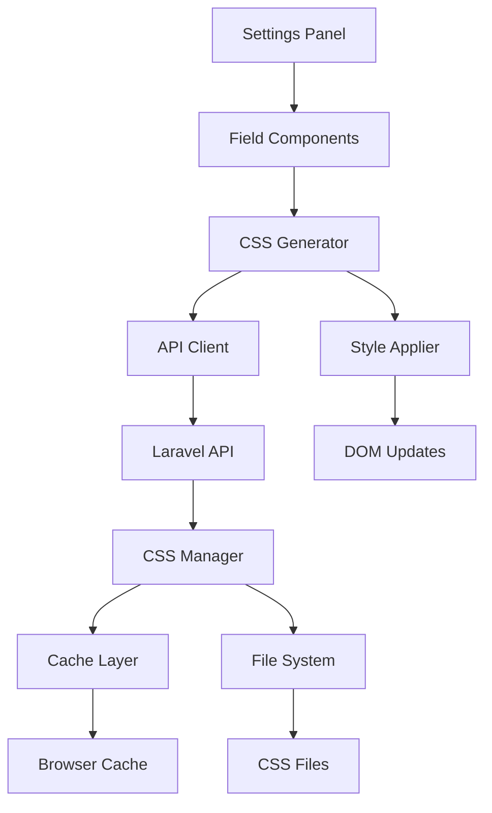

# Dynamic CSS Generation Guide

## Overview

This comprehensive guide covers the dynamic CSS generation system in the PageBuilder, explaining how field values from React settings panels are converted to CSS styles, processed on both frontend and backend, and applied to widgets and content elements.

## Table of Contents

1. [System Architecture](#system-architecture)
2. [Frontend CSS Generation (React)](#frontend-css-generation-react)
3. [Backend CSS Processing (PHP)](#backend-css-processing-php)
4. [Field-to-CSS Mapping](#field-to-css-mapping)
5. [Responsive CSS Generation](#responsive-css-generation)
6. [CSS Selector System](#css-selector-system)
7. [Caching and Optimization](#caching-and-optimization)
8. [Custom CSS Integration](#custom-css-integration)
9. [Debug and Development Tools](#debug-and-development-tools)

## System Architecture

### CSS Generation Flow

```
┌─────────────────┐    ┌─────────────────┐    ┌─────────────────┐
│ React Settings  │    │ CSS Generator   │    │ PHP Processor   │
│ Panel Changes   │───►│ (JavaScript)    │───►│ (Laravel)       │
└─────────────────┘    └─────────────────┘    └─────────────────┘
        │                       │                       │
        ▼                       ▼                       ▼
┌─────────────────┐    ┌─────────────────┐    ┌─────────────────┐
│ Field Values    │    │ CSS Rules       │    │ Cached Styles   │
│ - Typography    │    │ - Responsive    │    │ - Minified      │
│ - Colors        │    │ - Selectors     │    │ - Optimized     │
│ - Spacing       │    │ - Media Queries │    │ - Versioned     │
└─────────────────┘    └─────────────────┘    └─────────────────┘
```

### Component Interaction Map



## Frontend CSS Generation (React)

### Core CSS Generator Class

```javascript
// resources/js/Services/CSSGenerator.js
class CSSGenerator {
    constructor() {
        this.cache = new Map();
        this.deviceBreakpoints = {
            mobile: { max: 767 },
            tablet: { min: 768, max: 1023 },
            desktop: { min: 1024 }
        };
        this.cssVarPrefix = '--pb';
        this.selectorPrefix = '.pb-widget';
    }

    /**
     * Generate CSS from widget settings
     */
    generateWidgetCSS(widgetId, widgetType, settings = {}) {
        const cacheKey = `${widgetType}_${JSON.stringify(settings)}`;

        if (this.cache.has(cacheKey)) {
            return this.cache.get(cacheKey);
        }

        const css = {
            base: this.generateBaseCSS(widgetId, settings),
            responsive: this.generateResponsiveCSS(widgetId, settings),
            states: this.generateStateCSS(widgetId, settings),
            custom: this.processCustomCSS(widgetId, settings.customCSS || '')
        };

        const compiledCSS = this.compileCSS(css);
        this.cache.set(cacheKey, compiledCSS);

        return compiledCSS;
    }

    /**
     * Generate base CSS styles
     */
    generateBaseCSS(widgetId, settings) {
        const selector = `${this.selectorPrefix}-${widgetId}`;
        let styles = '';

        // Typography
        if (settings.typography) {
            styles += this.generateTypographyCSS(selector, settings.typography);
        }

        // Colors
        if (settings.textColor) {
            styles += `${selector} { color: ${settings.textColor}; }\n`;
        }

        // Background
        if (settings.background) {
            styles += this.generateBackgroundCSS(selector, settings.background);
        }

        // Spacing
        if (settings.padding) {
            styles += this.generateSpacingCSS(selector, 'padding', settings.padding);
        }

        if (settings.margin) {
            styles += this.generateSpacingCSS(selector, 'margin', settings.margin);
        }

        // Border
        if (settings.border) {
            styles += this.generateBorderCSS(selector, settings.border);
        }

        // Shadow
        if (settings.shadow && settings.shadow.enabled) {
            styles += this.generateShadowCSS(selector, settings.shadow);
        }

        // Display and Layout
        if (settings.display) {
            styles += `${selector} { display: ${settings.display}; }\n`;
        }

        // Flexbox properties
        if (settings.display === 'flex') {
            styles += this.generateFlexboxCSS(selector, settings);
        }

        // Positioning
        if (settings.position) {
            styles += this.generatePositionCSS(selector, settings);
        }

        // Visibility
        if (settings.visibility) {
            styles += this.generateVisibilityCSS(selector, settings.visibility);
        }

        return styles;
    }

    /**
     * Generate typography CSS
     */
    generateTypographyCSS(selector, typography) {
        let css = '';

        if (typography.fontFamily) {
            css += `${selector} { font-family: ${typography.fontFamily}; }\n`;
        }

        if (typography.fontSize) {
            if (typeof typography.fontSize === 'object') {
                // Responsive font size
                css += `${selector} { font-size: ${typography.fontSize.desktop}; }\n`;
            } else {
                css += `${selector} { font-size: ${typography.fontSize}; }\n`;
            }
        }

        if (typography.fontWeight) {
            css += `${selector} { font-weight: ${typography.fontWeight}; }\n`;
        }

        if (typography.lineHeight) {
            css += `${selector} { line-height: ${typography.lineHeight}; }\n`;
        }

        if (typography.letterSpacing) {
            css += `${selector} { letter-spacing: ${typography.letterSpacing}; }\n`;
        }

        if (typography.textTransform) {
            css += `${selector} { text-transform: ${typography.textTransform}; }\n`;
        }

        if (typography.textAlign) {
            if (typeof typography.textAlign === 'object') {
                // Responsive text align
                css += `${selector} { text-align: ${typography.textAlign.desktop}; }\n`;
            } else {
                css += `${selector} { text-align: ${typography.textAlign}; }\n`;
            }
        }

        if (typography.textDecoration) {
            css += `${selector} { text-decoration: ${typography.textDecoration}; }\n`;
        }

        return css;
    }

    /**
     * Generate background CSS
     */
    generateBackgroundCSS(selector, background) {
        let css = '';

        switch (background.type) {
            case 'color':
                css += `${selector} { background-color: ${background.color}; }\n`;
                break;

            case 'gradient':
                const gradient = background.gradient;
                const stops = gradient.colorStops.map(stop =>
                    `${stop.color} ${stop.position}%`
                ).join(', ');

                if (gradient.type === 'linear') {
                    css += `${selector} { background: linear-gradient(${gradient.angle}deg, ${stops}); }\n`;
                } else if (gradient.type === 'radial') {
                    css += `${selector} { background: radial-gradient(circle at ${gradient.position}, ${stops}); }\n`;
                }
                break;

            case 'image':
                const img = background.image;
                css += `${selector} {\n`;
                css += `  background-image: url('${img.url}');\n`;
                css += `  background-size: ${img.size};\n`;
                css += `  background-position: ${img.position};\n`;
                css += `  background-repeat: ${img.repeat};\n`;
                css += `  background-attachment: ${img.attachment};\n`;
                css += `}\n`;
                break;

            case 'none':
            default:
                css += `${selector} { background: none; }\n`;
                break;
        }

        // Background overlay
        if (background.overlay && background.overlay.enabled) {
            const overlay = background.overlay;
            css += `${selector}::before {\n`;
            css += `  content: '';\n`;
            css += `  position: absolute;\n`;
            css += `  top: 0;\n`;
            css += `  left: 0;\n`;
            css += `  right: 0;\n`;
            css += `  bottom: 0;\n`;
            css += `  background-color: ${overlay.color};\n`;
            css += `  opacity: ${overlay.opacity};\n`;
            css += `  pointer-events: none;\n`;
            css += `  z-index: 1;\n`;
            css += `}\n`;
        }

        // Hover effects
        if (background.hover) {
            css += this.generateBackgroundHoverCSS(selector, background.hover);
        }

        return css;
    }

    /**
     * Generate spacing CSS (padding/margin)
     */
    generateSpacingCSS(selector, property, spacing) {
        let css = '';

        if (typeof spacing === 'object' && spacing.top !== undefined) {
            // Individual values
            const unit = spacing.unit || 'px';
            css += `${selector} {\n`;
            css += `  ${property}: ${spacing.top}${unit} ${spacing.right}${unit} ${spacing.bottom}${unit} ${spacing.left}${unit};\n`;
            css += `}\n`;
        } else if (typeof spacing === 'string') {
            // Single value
            css += `${selector} { ${property}: ${spacing}; }\n`;
        }

        return css;
    }

    /**
     * Generate border CSS
     */
    generateBorderCSS(selector, border) {
        let css = '';

        // Border width, style, and color
        if (border.width > 0) {
            css += `${selector} {\n`;
            css += `  border: ${border.width}px ${border.style} ${border.color};\n`;
            css += `}\n`;
        }

        // Border radius
        if (border.radius) {
            const radius = border.radius;
            if (typeof radius === 'object') {
                const unit = radius.unit || 'px';
                css += `${selector} {\n`;
                css += `  border-radius: ${radius.top}${unit} ${radius.right}${unit} ${radius.bottom}${unit} ${radius.left}${unit};\n`;
                css += `}\n`;
            } else {
                css += `${selector} { border-radius: ${radius}; }\n`;
            }
        }

        // Individual border sides
        ['top', 'right', 'bottom', 'left'].forEach(side => {
            if (border[side]) {
                const sideBorder = border[side];
                css += `${selector} {\n`;
                css += `  border-${side}: ${sideBorder.width}px ${sideBorder.style} ${sideBorder.color};\n`;
                css += `}\n`;
            }
        });

        return css;
    }

    /**
     * Generate box shadow CSS
     */
    generateShadowCSS(selector, shadow) {
        let css = '';

        const shadowValue = `${shadow.inset ? 'inset ' : ''}${shadow.x}px ${shadow.y}px ${shadow.blur}px ${shadow.spread}px ${shadow.color}`;

        css += `${selector} {\n`;
        css += `  box-shadow: ${shadowValue};\n`;
        css += `}\n`;

        return css;
    }

    /**
     * Generate flexbox CSS
     */
    generateFlexboxCSS(selector, settings) {
        let css = '';

        if (settings.flexDirection) {
            css += `${selector} { flex-direction: ${settings.flexDirection}; }\n`;
        }

        if (settings.justifyContent) {
            css += `${selector} { justify-content: ${settings.justifyContent}; }\n`;
        }

        if (settings.alignItems) {
            css += `${selector} { align-items: ${settings.alignItems}; }\n`;
        }

        if (settings.alignContent) {
            css += `${selector} { align-content: ${settings.alignContent}; }\n`;
        }

        if (settings.flexWrap) {
            css += `${selector} { flex-wrap: ${settings.flexWrap}; }\n`;
        }

        if (settings.gap) {
            if (typeof settings.gap === 'object') {
                css += `${selector} {\n`;
                css += `  row-gap: ${settings.gap.row};\n`;
                css += `  column-gap: ${settings.gap.column};\n`;
                css += `}\n`;
            } else {
                css += `${selector} { gap: ${settings.gap}; }\n`;
            }
        }

        return css;
    }

    /**
     * Generate responsive CSS with media queries
     */
    generateResponsiveCSS(widgetId, settings) {
        let css = '';

        Object.entries(this.deviceBreakpoints).forEach(([device, breakpoint]) => {
            const deviceSettings = this.extractDeviceSettings(settings, device);

            if (Object.keys(deviceSettings).length === 0) {
                return;
            }

            const deviceCSS = this.generateBaseCSS(widgetId, deviceSettings);

            if (deviceCSS) {
                css += this.wrapInMediaQuery(deviceCSS, breakpoint);
            }
        });

        return css;
    }

    /**
     * Extract device-specific settings
     */
    extractDeviceSettings(settings, device) {
        const deviceSettings = {};

        Object.entries(settings).forEach(([key, value]) => {
            if (typeof value === 'object' && value[device] !== undefined) {
                deviceSettings[key] = value[device];
            }
        });

        return deviceSettings;
    }

    /**
     * Wrap CSS in media query
     */
    wrapInMediaQuery(css, breakpoint) {
        let mediaQuery = '@media ';

        if (breakpoint.min && breakpoint.max) {
            mediaQuery += `(min-width: ${breakpoint.min}px) and (max-width: ${breakpoint.max}px)`;
        } else if (breakpoint.min) {
            mediaQuery += `(min-width: ${breakpoint.min}px)`;
        } else if (breakpoint.max) {
            mediaQuery += `(max-width: ${breakpoint.max}px)`;
        }

        return `${mediaQuery} {\n${css}}\n`;
    }

    /**
     * Generate state-based CSS (hover, focus, active)
     */
    generateStateCSS(widgetId, settings) {
        let css = '';
        const selector = `${this.selectorPrefix}-${widgetId}`;

        // Hover states
        if (settings.hover) {
            css += this.generateHoverCSS(selector, settings.hover);
        }

        // Focus states
        if (settings.focus) {
            css += this.generateFocusCSS(selector, settings.focus);
        }

        // Active states
        if (settings.active) {
            css += this.generateActiveCSS(selector, settings.active);
        }

        return css;
    }

    /**
     * Generate hover CSS
     */
    generateHoverCSS(selector, hoverSettings) {
        let css = '';

        if (hoverSettings.backgroundColor) {
            css += `${selector}:hover { background-color: ${hoverSettings.backgroundColor}; }\n`;
        }

        if (hoverSettings.textColor) {
            css += `${selector}:hover { color: ${hoverSettings.textColor}; }\n`;
        }

        if (hoverSettings.transform) {
            css += `${selector}:hover { transform: ${hoverSettings.transform}; }\n`;
        }

        if (hoverSettings.transition) {
            css += `${selector} { transition: ${hoverSettings.transition}; }\n`;
        }

        return css;
    }

    /**
     * Process custom CSS with selector replacement
     */
    processCustomCSS(widgetId, customCSS) {
        if (!customCSS) return '';

        const selector = `${this.selectorPrefix}-${widgetId}`;

        // Replace {{WRAPPER}} placeholder
        let processedCSS = customCSS.replace(/\{\{WRAPPER\}\}/g, selector);

        // Add automatic scoping if not present
        if (!processedCSS.includes(selector)) {
            processedCSS = `${selector} {\n${processedCSS}\n}`;
        }

        return processedCSS;
    }

    /**
     * Compile all CSS parts into final stylesheet
     */
    compileCSS(cssObject) {
        let compiled = '';

        // Base styles first
        if (cssObject.base) {
            compiled += cssObject.base;
        }

        // State styles
        if (cssObject.states) {
            compiled += cssObject.states;
        }

        // Responsive styles
        if (cssObject.responsive) {
            compiled += cssObject.responsive;
        }

        // Custom styles last (highest priority)
        if (cssObject.custom) {
            compiled += cssObject.custom;
        }

        return this.minifyCSS(compiled);
    }

    /**
     * Minify CSS for production
     */
    minifyCSS(css) {
        return css
            .replace(/\/\*[\s\S]*?\*\//g, '') // Remove comments
            .replace(/\s+/g, ' ') // Collapse whitespace
            .replace(/;\s*}/g, '}') // Remove trailing semicolons
            .replace(/\s*{\s*/g, '{') // Clean braces
            .replace(/}\s*/g, '}') // Clean closing braces
            .trim();
    }

    /**
     * Clear cache
     */
    clearCache() {
        this.cache.clear();
    }

    /**
     * Get cache statistics
     */
    getCacheStats() {
        return {
            size: this.cache.size,
            keys: Array.from(this.cache.keys())
        };
    }
}

export const cssGenerator = new CSSGenerator();
```

### CSS Application System

```javascript
// resources/js/Services/StyleApplier.js
class StyleApplier {
    constructor() {
        this.styleSheets = new Map();
        this.styleElement = null;
        this.initializeStyleElement();
    }

    initializeStyleElement() {
        // Create or get the pagebuilder style element
        this.styleElement = document.getElementById('pagebuilder-dynamic-styles');

        if (!this.styleElement) {
            this.styleElement = document.createElement('style');
            this.styleElement.id = 'pagebuilder-dynamic-styles';
            this.styleElement.type = 'text/css';
            document.head.appendChild(this.styleElement);
        }
    }

    /**
     * Apply CSS for a specific widget
     */
    applyWidgetCSS(widgetId, css) {
        this.styleSheets.set(widgetId, css);
        this.updateStyleElement();
    }

    /**
     * Remove CSS for a widget
     */
    removeWidgetCSS(widgetId) {
        this.styleSheets.delete(widgetId);
        this.updateStyleElement();
    }

    /**
     * Update the style element with all accumulated styles
     */
    updateStyleElement() {
        const allCSS = Array.from(this.styleSheets.values()).join('\n');
        this.styleElement.textContent = allCSS;
    }

    /**
     * Apply inline styles to an element
     */
    applyInlineStyles(element, styles) {
        if (!element || !styles) return;

        Object.entries(styles).forEach(([property, value]) => {
            if (value !== null && value !== undefined) {
                element.style[property] = value;
            }
        });
    }

    /**
     * Apply CSS variables
     */
    applyCSSVariables(widgetId, variables) {
        const element = document.querySelector(`[data-widget-id="${widgetId}"]`);

        if (element && variables) {
            Object.entries(variables).forEach(([key, value]) => {
                element.style.setProperty(`--pb-${key}`, value);
            });
        }
    }

    /**
     * Get computed styles for an element
     */
    getComputedStyles(element, properties = []) {
        if (!element) return {};

        const computed = window.getComputedStyle(element);
        const styles = {};

        if (properties.length === 0) {
            // Return all styles
            for (let i = 0; i < computed.length; i++) {
                const property = computed[i];
                styles[property] = computed.getPropertyValue(property);
            }
        } else {
            // Return specific properties
            properties.forEach(property => {
                styles[property] = computed.getPropertyValue(property);
            });
        }

        return styles;
    }

    /**
     * Clear all styles
     */
    clearAllStyles() {
        this.styleSheets.clear();
        this.updateStyleElement();
    }

    /**
     * Get current stylesheet content
     */
    getCurrentStylesheet() {
        return this.styleElement.textContent;
    }
}

export const styleApplier = new StyleApplier();
```

### React Integration Hook

```javascript
// resources/js/Hooks/useWidgetStyles.js
import { useEffect, useCallback, useMemo } from 'react';
import { usePageBuilderStore } from '../Store/pageBuilderStore';
import { cssGenerator } from '../Services/CSSGenerator';
import { styleApplier } from '../Services/StyleApplier';

export const useWidgetStyles = (widgetId, widgetType, settings) => {
    const { devicePreview } = usePageBuilderStore();

    // Generate CSS based on current settings
    const generatedCSS = useMemo(() => {
        if (!settings || Object.keys(settings).length === 0) {
            return '';
        }

        return cssGenerator.generateWidgetCSS(widgetId, widgetType, settings);
    }, [widgetId, widgetType, settings]);

    // Apply styles when CSS changes
    useEffect(() => {
        if (generatedCSS) {
            styleApplier.applyWidgetCSS(widgetId, generatedCSS);
        }

        // Cleanup when component unmounts
        return () => {
            styleApplier.removeWidgetCSS(widgetId);
        };
    }, [widgetId, generatedCSS]);

    // Generate inline styles for immediate application
    const inlineStyles = useMemo(() => {
        const styles = {};

        // Extract device-specific styles for immediate application
        if (settings) {
            // Typography
            if (settings.typography?.fontSize) {
                const fontSize = typeof settings.typography.fontSize === 'object'
                    ? settings.typography.fontSize[devicePreview]
                    : settings.typography.fontSize;
                if (fontSize) styles.fontSize = fontSize;
            }

            // Colors
            if (settings.textColor) {
                styles.color = settings.textColor;
            }

            // Background
            if (settings.backgroundColor) {
                styles.backgroundColor = settings.backgroundColor;
            }

            // Display
            if (settings.display) {
                styles.display = settings.display;
            }
        }

        return styles;
    }, [settings, devicePreview]);

    // Function to update specific style properties
    const updateStyleProperty = useCallback((property, value) => {
        const element = document.querySelector(`[data-widget-id="${widgetId}"]`);
        if (element) {
            styleApplier.applyInlineStyles(element, { [property]: value });
        }
    }, [widgetId]);

    return {
        generatedCSS,
        inlineStyles,
        updateStyleProperty
    };
};
```

## Backend CSS Processing (PHP)

### CSS Manager System

```php
<?php
// app/Services/CSSManager.php
namespace App\Services;

class CSSManager
{
    private string $cacheDirectory;
    private int $cacheTTL;
    private array $breakpoints;

    public function __construct()
    {
        $this->cacheDirectory = storage_path('app/pagebuilder/css/');
        $this->cacheTTL = config('pagebuilder.css_cache_ttl', 3600); // 1 hour
        $this->breakpoints = config('pagebuilder.breakpoints', [
            'mobile' => ['max' => 767],
            'tablet' => ['min' => 768, 'max' => 1023],
            'desktop' => ['min' => 1024]
        ]);

        $this->ensureCacheDirectory();
    }

    /**
     * Generate CSS from widget settings
     */
    public function generateWidgetCSS(string $widgetId, string $widgetType, array $settings): string
    {
        $cacheKey = $this->getCacheKey($widgetId, $widgetType, $settings);

        // Check cache first
        if ($this->isCacheValid($cacheKey)) {
            return $this->getCachedCSS($cacheKey);
        }

        $css = $this->buildWidgetCSS($widgetId, $widgetType, $settings);

        // Cache the result
        $this->cacheCSS($cacheKey, $css);

        return $css;
    }

    /**
     * Build CSS from settings
     */
    private function buildWidgetCSS(string $widgetId, string $widgetType, array $settings): string
    {
        $cssBuilder = new CSSBuilder($widgetId, $widgetType);

        // Base styles
        $cssBuilder->addBaseStyles($this->generateBaseCSS($settings));

        // Typography
        if (isset($settings['typography'])) {
            $cssBuilder->addTypographyStyles($this->generateTypographyCSS($settings['typography']));
        }

        // Colors
        $cssBuilder->addColorStyles($this->generateColorCSS($settings));

        // Background
        if (isset($settings['background'])) {
            $cssBuilder->addBackgroundStyles($this->generateBackgroundCSS($settings['background']));
        }

        // Spacing
        if (isset($settings['padding'])) {
            $cssBuilder->addSpacingStyles('padding', $this->generateSpacingCSS($settings['padding']));
        }

        if (isset($settings['margin'])) {
            $cssBuilder->addSpacingStyles('margin', $this->generateSpacingCSS($settings['margin']));
        }

        // Border and Shadow
        if (isset($settings['border'])) {
            $cssBuilder->addBorderStyles($this->generateBorderCSS($settings['border']));
        }

        if (isset($settings['shadow']) && $settings['shadow']['enabled'] ?? false) {
            $cssBuilder->addShadowStyles($this->generateShadowCSS($settings['shadow']));
        }

        // Flexbox
        if (isset($settings['display']) && $settings['display'] === 'flex') {
            $cssBuilder->addFlexboxStyles($this->generateFlexboxCSS($settings));
        }

        // Responsive styles
        $cssBuilder->addResponsiveStyles($this->generateResponsiveCSS($settings));

        // Custom CSS
        if (isset($settings['customCSS']) && !empty($settings['customCSS'])) {
            $cssBuilder->addCustomStyles($this->processCustomCSS($widgetId, $settings['customCSS']));
        }

        return $cssBuilder->compile();
    }

    /**
     * Generate typography CSS
     */
    private function generateTypographyCSS(array $typography): array
    {
        $styles = [];

        if (isset($typography['fontFamily'])) {
            $styles['font-family'] = $typography['fontFamily'];
        }

        if (isset($typography['fontSize'])) {
            if (is_array($typography['fontSize'])) {
                // Responsive font size
                $styles['font-size'] = $typography['fontSize']['desktop'] ?? '16px';
            } else {
                $styles['font-size'] = $typography['fontSize'];
            }
        }

        if (isset($typography['fontWeight'])) {
            $styles['font-weight'] = $typography['fontWeight'];
        }

        if (isset($typography['lineHeight'])) {
            $styles['line-height'] = $typography['lineHeight'];
        }

        if (isset($typography['letterSpacing'])) {
            $styles['letter-spacing'] = $typography['letterSpacing'];
        }

        if (isset($typography['textTransform'])) {
            $styles['text-transform'] = $typography['textTransform'];
        }

        if (isset($typography['textAlign'])) {
            if (is_array($typography['textAlign'])) {
                $styles['text-align'] = $typography['textAlign']['desktop'] ?? 'left';
            } else {
                $styles['text-align'] = $typography['textAlign'];
            }
        }

        return $styles;
    }

    /**
     * Generate background CSS
     */
    private function generateBackgroundCSS(array $background): array
    {
        $styles = [];

        switch ($background['type']) {
            case 'color':
                $styles['background-color'] = $background['color'];
                break;

            case 'gradient':
                $gradient = $background['gradient'];
                $stops = collect($gradient['colorStops'])
                    ->map(fn($stop) => "{$stop['color']} {$stop['position']}%")
                    ->join(', ');

                if ($gradient['type'] === 'linear') {
                    $styles['background'] = "linear-gradient({$gradient['angle']}deg, {$stops})";
                } elseif ($gradient['type'] === 'radial') {
                    $position = $gradient['position'] ?? 'center center';
                    $styles['background'] = "radial-gradient(circle at {$position}, {$stops})";
                }
                break;

            case 'image':
                $image = $background['image'];
                $styles['background-image'] = "url('{$image['url']}')";
                $styles['background-size'] = $image['size'];
                $styles['background-position'] = $image['position'];
                $styles['background-repeat'] = $image['repeat'];
                $styles['background-attachment'] = $image['attachment'];
                break;

            case 'none':
            default:
                $styles['background'] = 'none';
                break;
        }

        return $styles;
    }

    /**
     * Generate spacing CSS
     */
    private function generateSpacingCSS(array $spacing): string
    {
        if (isset($spacing['top'], $spacing['right'], $spacing['bottom'], $spacing['left'])) {
            $unit = $spacing['unit'] ?? 'px';
            return "{$spacing['top']}{$unit} {$spacing['right']}{$unit} {$spacing['bottom']}{$unit} {$spacing['left']}{$unit}";
        }

        return $spacing['value'] ?? '0';
    }

    /**
     * Generate border CSS
     */
    private function generateBorderCSS(array $border): array
    {
        $styles = [];

        if (isset($border['width']) && $border['width'] > 0) {
            $styles['border-width'] = $border['width'] . 'px';
            $styles['border-style'] = $border['style'] ?? 'solid';
            $styles['border-color'] = $border['color'] ?? '#000000';
        }

        if (isset($border['radius'])) {
            $radius = $border['radius'];
            if (is_array($radius)) {
                $unit = $radius['unit'] ?? 'px';
                $styles['border-radius'] = "{$radius['top']}{$unit} {$radius['right']}{$unit} {$radius['bottom']}{$unit} {$radius['left']}{$unit}";
            } else {
                $styles['border-radius'] = $radius;
            }
        }

        return $styles;
    }

    /**
     * Generate box shadow CSS
     */
    private function generateShadowCSS(array $shadow): array
    {
        $inset = isset($shadow['inset']) && $shadow['inset'] ? 'inset ' : '';
        $x = $shadow['x'] ?? 0;
        $y = $shadow['y'] ?? 0;
        $blur = $shadow['blur'] ?? 0;
        $spread = $shadow['spread'] ?? 0;
        $color = $shadow['color'] ?? 'rgba(0, 0, 0, 0.1)';

        return [
            'box-shadow' => "{$inset}{$x}px {$y}px {$blur}px {$spread}px {$color}"
        ];
    }

    /**
     * Generate flexbox CSS
     */
    private function generateFlexboxCSS(array $settings): array
    {
        $styles = [];

        if (isset($settings['flexDirection'])) {
            $styles['flex-direction'] = $settings['flexDirection'];
        }

        if (isset($settings['justifyContent'])) {
            $styles['justify-content'] = $settings['justifyContent'];
        }

        if (isset($settings['alignItems'])) {
            $styles['align-items'] = $settings['alignItems'];
        }

        if (isset($settings['flexWrap'])) {
            $styles['flex-wrap'] = $settings['flexWrap'];
        }

        if (isset($settings['gap'])) {
            if (is_array($settings['gap'])) {
                $styles['row-gap'] = $settings['gap']['row'] ?? '0';
                $styles['column-gap'] = $settings['gap']['column'] ?? '0';
            } else {
                $styles['gap'] = $settings['gap'];
            }
        }

        return $styles;
    }

    /**
     * Generate responsive CSS
     */
    private function generateResponsiveCSS(array $settings): array
    {
        $responsiveCSS = [];

        foreach ($this->breakpoints as $device => $breakpoint) {
            $deviceSettings = $this->extractDeviceSettings($settings, $device);

            if (!empty($deviceSettings)) {
                $deviceCSS = $this->buildDeviceCSS($deviceSettings);

                if (!empty($deviceCSS)) {
                    $responsiveCSS[$device] = [
                        'breakpoint' => $breakpoint,
                        'styles' => $deviceCSS
                    ];
                }
            }
        }

        return $responsiveCSS;
    }

    /**
     * Extract device-specific settings
     */
    private function extractDeviceSettings(array $settings, string $device): array
    {
        $deviceSettings = [];

        foreach ($settings as $key => $value) {
            if (is_array($value) && isset($value[$device])) {
                $deviceSettings[$key] = $value[$device];
            }
        }

        return $deviceSettings;
    }

    /**
     * Process custom CSS
     */
    private function processCustomCSS(string $widgetId, string $customCSS): string
    {
        $selector = ".pb-widget-{$widgetId}";

        // Replace {{WRAPPER}} placeholder
        $processedCSS = str_replace('{{WRAPPER}}', $selector, $customCSS);

        // Add automatic scoping if not present
        if (!str_contains($processedCSS, $selector)) {
            $processedCSS = "{$selector} {\n{$processedCSS}\n}";
        }

        return $processedCSS;
    }

    /**
     * Cache management
     */
    private function getCacheKey(string $widgetId, string $widgetType, array $settings): string
    {
        return md5("{$widgetId}_{$widgetType}_" . serialize($settings));
    }

    private function isCacheValid(string $cacheKey): bool
    {
        $cachePath = $this->cacheDirectory . $cacheKey . '.css';

        return file_exists($cachePath) &&
               (time() - filemtime($cachePath)) < $this->cacheTTL;
    }

    private function getCachedCSS(string $cacheKey): string
    {
        $cachePath = $this->cacheDirectory . $cacheKey . '.css';
        return file_get_contents($cachePath);
    }

    private function cacheCSS(string $cacheKey, string $css): void
    {
        $cachePath = $this->cacheDirectory . $cacheKey . '.css';
        file_put_contents($cachePath, $css);
    }

    private function ensureCacheDirectory(): void
    {
        if (!is_dir($this->cacheDirectory)) {
            mkdir($this->cacheDirectory, 0755, true);
        }
    }

    /**
     * Clear CSS cache
     */
    public function clearCache(): void
    {
        $files = glob($this->cacheDirectory . '*.css');
        foreach ($files as $file) {
            unlink($file);
        }
    }
}
```

### CSS Builder Class

```php
<?php
// app/Services/CSSBuilder.php
namespace App\Services;

class CSSBuilder
{
    private string $widgetId;
    private string $widgetType;
    private array $styles = [];
    private array $mediaQueries = [];
    private array $customCSS = [];

    public function __construct(string $widgetId, string $widgetType)
    {
        $this->widgetId = $widgetId;
        $this->widgetType = $widgetType;
    }

    /**
     * Add base styles
     */
    public function addBaseStyles(array $styles): self
    {
        $this->styles = array_merge($this->styles, $styles);
        return $this;
    }

    /**
     * Add typography styles
     */
    public function addTypographyStyles(array $styles): self
    {
        foreach ($styles as $property => $value) {
            $this->styles[$property] = $value;
        }
        return $this;
    }

    /**
     * Add color styles
     */
    public function addColorStyles(array $settings): self
    {
        if (isset($settings['textColor'])) {
            $this->styles['color'] = $settings['textColor'];
        }

        if (isset($settings['backgroundColor'])) {
            $this->styles['background-color'] = $settings['backgroundColor'];
        }

        return $this;
    }

    /**
     * Add background styles
     */
    public function addBackgroundStyles(array $styles): self
    {
        foreach ($styles as $property => $value) {
            $this->styles[$property] = $value;
        }
        return $this;
    }

    /**
     * Add spacing styles
     */
    public function addSpacingStyles(string $type, string $value): self
    {
        $this->styles[$type] = $value;
        return $this;
    }

    /**
     * Add border styles
     */
    public function addBorderStyles(array $styles): self
    {
        foreach ($styles as $property => $value) {
            $this->styles[$property] = $value;
        }
        return $this;
    }

    /**
     * Add shadow styles
     */
    public function addShadowStyles(array $styles): self
    {
        foreach ($styles as $property => $value) {
            $this->styles[$property] = $value;
        }
        return $this;
    }

    /**
     * Add flexbox styles
     */
    public function addFlexboxStyles(array $styles): self
    {
        foreach ($styles as $property => $value) {
            $this->styles[$property] = $value;
        }
        return $this;
    }

    /**
     * Add responsive styles
     */
    public function addResponsiveStyles(array $responsiveCSS): self
    {
        foreach ($responsiveCSS as $device => $deviceData) {
            $breakpoint = $deviceData['breakpoint'];
            $styles = $deviceData['styles'];

            $mediaQuery = $this->buildMediaQuery($breakpoint);

            if (!isset($this->mediaQueries[$mediaQuery])) {
                $this->mediaQueries[$mediaQuery] = [];
            }

            $this->mediaQueries[$mediaQuery] = array_merge(
                $this->mediaQueries[$mediaQuery],
                $styles
            );
        }

        return $this;
    }

    /**
     * Add custom CSS
     */
    public function addCustomStyles(string $css): self
    {
        $this->customCSS[] = $css;
        return $this;
    }

    /**
     * Build media query string
     */
    private function buildMediaQuery(array $breakpoint): string
    {
        $conditions = [];

        if (isset($breakpoint['min'])) {
            $conditions[] = "(min-width: {$breakpoint['min']}px)";
        }

        if (isset($breakpoint['max'])) {
            $conditions[] = "(max-width: {$breakpoint['max']}px)";
        }

        return '@media ' . implode(' and ', $conditions);
    }

    /**
     * Compile all styles into CSS
     */
    public function compile(): string
    {
        $css = '';
        $selector = ".pb-widget-{$this->widgetId}";

        // Base styles
        if (!empty($this->styles)) {
            $css .= "{$selector} {\n";
            foreach ($this->styles as $property => $value) {
                $css .= "  {$property}: {$value};\n";
            }
            $css .= "}\n\n";
        }

        // Media queries
        foreach ($this->mediaQueries as $mediaQuery => $styles) {
            if (!empty($styles)) {
                $css .= "{$mediaQuery} {\n";
                $css .= "  {$selector} {\n";
                foreach ($styles as $property => $value) {
                    $css .= "    {$property}: {$value};\n";
                }
                $css .= "  }\n";
                $css .= "}\n\n";
            }
        }

        // Custom CSS
        foreach ($this->customCSS as $customStyles) {
            $css .= $customStyles . "\n\n";
        }

        return trim($css);
    }
}
```

## Field-to-CSS Mapping

### Mapping Configuration

```php
<?php
// config/pagebuilder.php
return [
    'css_mapping' => [
        // Typography mappings
        'typography' => [
            'fontFamily' => 'font-family',
            'fontSize' => 'font-size',
            'fontWeight' => 'font-weight',
            'lineHeight' => 'line-height',
            'letterSpacing' => 'letter-spacing',
            'textTransform' => 'text-transform',
            'textAlign' => 'text-align',
            'textDecoration' => 'text-decoration'
        ],

        // Color mappings
        'colors' => [
            'textColor' => 'color',
            'backgroundColor' => 'background-color',
            'borderColor' => 'border-color'
        ],

        // Spacing mappings
        'spacing' => [
            'padding' => 'padding',
            'margin' => 'margin',
            'paddingTop' => 'padding-top',
            'paddingRight' => 'padding-right',
            'paddingBottom' => 'padding-bottom',
            'paddingLeft' => 'padding-left',
            'marginTop' => 'margin-top',
            'marginRight' => 'margin-right',
            'marginBottom' => 'margin-bottom',
            'marginLeft' => 'margin-left'
        ],

        // Border mappings
        'border' => [
            'borderWidth' => 'border-width',
            'borderStyle' => 'border-style',
            'borderColor' => 'border-color',
            'borderRadius' => 'border-radius'
        ],

        // Display mappings
        'layout' => [
            'display' => 'display',
            'position' => 'position',
            'top' => 'top',
            'right' => 'right',
            'bottom' => 'bottom',
            'left' => 'left',
            'zIndex' => 'z-index',
            'overflow' => 'overflow'
        ],

        // Flexbox mappings
        'flexbox' => [
            'flexDirection' => 'flex-direction',
            'justifyContent' => 'justify-content',
            'alignItems' => 'align-items',
            'alignContent' => 'align-content',
            'flexWrap' => 'flex-wrap',
            'gap' => 'gap',
            'rowGap' => 'row-gap',
            'columnGap' => 'column-gap'
        ]
    ],

    // Responsive breakpoints
    'breakpoints' => [
        'mobile' => ['max' => 767],
        'tablet' => ['min' => 768, 'max' => 1023],
        'desktop' => ['min' => 1024]
    ],

    // CSS cache settings
    'css_cache_ttl' => 3600, // 1 hour
    'minify_css' => env('APP_ENV') === 'production',
    'css_prefix' => 'pb-',

    // CSS optimization
    'optimize_css' => true,
    'combine_selectors' => true,
    'remove_unused_css' => false
];
```

### Field Mapping Service

```php
<?php
// app/Services/FieldCSSMapper.php
namespace App\Services;

class FieldCSSMapper
{
    private array $mapping;

    public function __construct()
    {
        $this->mapping = config('pagebuilder.css_mapping', []);
    }

    /**
     * Map field values to CSS properties
     */
    public function mapFieldsToCSS(array $settings): array
    {
        $cssProperties = [];

        foreach ($settings as $fieldKey => $value) {
            if ($value === null || $value === '') {
                continue;
            }

            $cssProperty = $this->getCSSProperty($fieldKey);

            if ($cssProperty) {
                $cssValue = $this->formatCSSValue($fieldKey, $value);
                $cssProperties[$cssProperty] = $cssValue;
            } else {
                // Handle complex mappings
                $cssProperties = array_merge(
                    $cssProperties,
                    $this->handleComplexMapping($fieldKey, $value)
                );
            }
        }

        return $cssProperties;
    }

    /**
     * Get CSS property name for field
     */
    private function getCSSProperty(string $fieldKey): ?string
    {
        foreach ($this->mapping as $group => $mappings) {
            if (isset($mappings[$fieldKey])) {
                return $mappings[$fieldKey];
            }
        }

        return null;
    }

    /**
     * Format value for CSS
     */
    private function formatCSSValue(string $fieldKey, $value): string
    {
        // Handle responsive values
        if (is_array($value) && isset($value['desktop'])) {
            return $this->formatCSSValue($fieldKey, $value['desktop']);
        }

        // Handle spacing objects
        if (is_array($value) && isset($value['top'], $value['right'], $value['bottom'], $value['left'])) {
            $unit = $value['unit'] ?? 'px';
            return "{$value['top']}{$unit} {$value['right']}{$unit} {$value['bottom']}{$unit} {$value['left']}{$unit}";
        }

        // Handle numeric values that need units
        if (is_numeric($value) && $this->needsUnit($fieldKey)) {
            return $value . $this->getDefaultUnit($fieldKey);
        }

        return (string) $value;
    }

    /**
     * Handle complex field mappings
     */
    private function handleComplexMapping(string $fieldKey, $value): array
    {
        $properties = [];

        switch ($fieldKey) {
            case 'background':
                $properties = $this->mapBackgroundField($value);
                break;

            case 'border':
                $properties = $this->mapBorderField($value);
                break;

            case 'shadow':
                $properties = $this->mapShadowField($value);
                break;

            case 'typography':
                $properties = $this->mapTypographyField($value);
                break;

            default:
                // No special handling
                break;
        }

        return $properties;
    }

    /**
     * Map background field to CSS properties
     */
    private function mapBackgroundField(array $background): array
    {
        $properties = [];

        switch ($background['type'] ?? 'none') {
            case 'color':
                $properties['background-color'] = $background['color'];
                break;

            case 'gradient':
                $gradient = $background['gradient'];
                $stops = collect($gradient['colorStops'])
                    ->map(fn($stop) => "{$stop['color']} {$stop['position']}%")
                    ->join(', ');

                if ($gradient['type'] === 'linear') {
                    $properties['background'] = "linear-gradient({$gradient['angle']}deg, {$stops})";
                } elseif ($gradient['type'] === 'radial') {
                    $properties['background'] = "radial-gradient(circle, {$stops})";
                }
                break;

            case 'image':
                $image = $background['image'];
                $properties['background-image'] = "url('{$image['url']}')";
                $properties['background-size'] = $image['size'];
                $properties['background-position'] = $image['position'];
                $properties['background-repeat'] = $image['repeat'];
                break;
        }

        return $properties;
    }

    /**
     * Map border field to CSS properties
     */
    private function mapBorderField(array $border): array
    {
        $properties = [];

        if (isset($border['width']) && $border['width'] > 0) {
            $properties['border-width'] = $border['width'] . 'px';
            $properties['border-style'] = $border['style'] ?? 'solid';
            $properties['border-color'] = $border['color'] ?? '#000000';
        }

        if (isset($border['radius'])) {
            $properties['border-radius'] = is_string($border['radius'])
                ? $border['radius']
                : $this->formatCSSValue('borderRadius', $border['radius']);
        }

        return $properties;
    }

    /**
     * Check if field needs CSS unit
     */
    private function needsUnit(string $fieldKey): bool
    {
        $unitFields = [
            'fontSize', 'lineHeight', 'letterSpacing',
            'paddingTop', 'paddingRight', 'paddingBottom', 'paddingLeft',
            'marginTop', 'marginRight', 'marginBottom', 'marginLeft',
            'borderWidth', 'borderRadius',
            'top', 'right', 'bottom', 'left',
            'width', 'height', 'maxWidth', 'maxHeight', 'minWidth', 'minHeight'
        ];

        return in_array($fieldKey, $unitFields);
    }

    /**
     * Get default unit for field
     */
    private function getDefaultUnit(string $fieldKey): string
    {
        $unitMap = [
            'fontSize' => 'px',
            'lineHeight' => '',
            'letterSpacing' => 'px',
            'borderWidth' => 'px',
            'borderRadius' => 'px'
        ];

        return $unitMap[$fieldKey] ?? 'px';
    }
}
```

## Responsive CSS Generation

### Responsive CSS Manager

```javascript
// resources/js/Services/ResponsiveCSSManager.js
class ResponsiveCSSManager {
    constructor() {
        this.breakpoints = {
            mobile: { max: 767 },
            tablet: { min: 768, max: 1023 },
            desktop: { min: 1024 }
        };

        this.deviceOrder = ['desktop', 'tablet', 'mobile'];
        this.currentDevice = this.getCurrentDevice();

        this.setupDeviceDetection();
    }

    /**
     * Generate responsive CSS from settings
     */
    generateResponsiveCSS(selector, settings) {
        let css = '';
        let baseCSS = '';
        let responsiveCSS = {};

        // Process each setting
        Object.entries(settings).forEach(([property, value]) => {
            if (this.isResponsiveValue(value)) {
                const { base, responsive } = this.splitResponsiveValue(value);

                if (base) {
                    baseCSS += this.formatCSSDeclaration(property, base);
                }

                Object.entries(responsive).forEach(([device, deviceValue]) => {
                    if (!responsiveCSS[device]) {
                        responsiveCSS[device] = '';
                    }
                    responsiveCSS[device] += this.formatCSSDeclaration(property, deviceValue);
                });
            } else {
                baseCSS += this.formatCSSDeclaration(property, value);
            }
        });

        // Build base CSS
        if (baseCSS) {
            css += `${selector} {\n${baseCSS}}\n\n`;
        }

        // Build responsive CSS
        Object.entries(responsiveCSS).forEach(([device, deviceCSS]) => {
            if (deviceCSS) {
                const mediaQuery = this.buildMediaQuery(device);
                css += `${mediaQuery} {\n  ${selector} {\n${this.indentCSS(deviceCSS)}  }\n}\n\n`;
            }
        });

        return css.trim();
    }

    /**
     * Check if value is responsive (has device-specific values)
     */
    isResponsiveValue(value) {
        return typeof value === 'object' &&
               value !== null &&
               (value.desktop !== undefined || value.tablet !== undefined || value.mobile !== undefined);
    }

    /**
     * Split responsive value into base and device-specific values
     */
    splitResponsiveValue(value) {
        const base = value.desktop || value.tablet || value.mobile;
        const responsive = {};

        this.deviceOrder.forEach(device => {
            if (value[device] !== undefined && value[device] !== base) {
                responsive[device] = value[device];
            }
        });

        return { base, responsive };
    }

    /**
     * Build media query for device
     */
    buildMediaQuery(device) {
        const breakpoint = this.breakpoints[device];
        const conditions = [];

        if (breakpoint.min) {
            conditions.push(`(min-width: ${breakpoint.min}px)`);
        }

        if (breakpoint.max) {
            conditions.push(`(max-width: ${breakpoint.max}px)`);
        }

        return `@media ${conditions.join(' and ')}`;
    }

    /**
     * Format CSS declaration
     */
    formatCSSDeclaration(property, value) {
        const cssProperty = this.mapFieldToCSS(property);
        const cssValue = this.formatCSSValue(property, value);

        return `  ${cssProperty}: ${cssValue};\n`;
    }

    /**
     * Map field name to CSS property
     */
    mapFieldToCSS(fieldName) {
        const mappings = {
            textColor: 'color',
            backgroundColor: 'background-color',
            fontSize: 'font-size',
            fontWeight: 'font-weight',
            lineHeight: 'line-height',
            textAlign: 'text-align',
            paddingTop: 'padding-top',
            paddingRight: 'padding-right',
            paddingBottom: 'padding-bottom',
            paddingLeft: 'padding-left',
            marginTop: 'margin-top',
            marginRight: 'margin-right',
            marginBottom: 'margin-bottom',
            marginLeft: 'margin-left'
        };

        return mappings[fieldName] || fieldName.replace(/([A-Z])/g, '-$1').toLowerCase();
    }

    /**
     * Format CSS value with units if needed
     */
    formatCSSValue(property, value) {
        if (typeof value === 'number' && this.needsUnit(property)) {
            return value + this.getDefaultUnit(property);
        }

        return value.toString();
    }

    /**
     * Check if property needs a unit
     */
    needsUnit(property) {
        const unitProperties = [
            'fontSize', 'lineHeight', 'letterSpacing',
            'paddingTop', 'paddingRight', 'paddingBottom', 'paddingLeft',
            'marginTop', 'marginRight', 'marginBottom', 'marginLeft',
            'borderWidth', 'borderRadius', 'width', 'height'
        ];

        return unitProperties.includes(property);
    }

    /**
     * Get default unit for property
     */
    getDefaultUnit(property) {
        const unitMap = {
            fontSize: 'px',
            lineHeight: '',
            letterSpacing: 'px',
            paddingTop: 'px',
            paddingRight: 'px',
            paddingBottom: 'px',
            paddingLeft: 'px',
            marginTop: 'px',
            marginRight: 'px',
            marginBottom: 'px',
            marginLeft: 'px',
            borderWidth: 'px',
            borderRadius: 'px',
            width: 'px',
            height: 'px'
        };

        return unitMap[property] || 'px';
    }

    /**
     * Add proper indentation to CSS
     */
    indentCSS(css) {
        return css.split('\n').map(line => line ? '  ' + line : line).join('\n');
    }

    /**
     * Get current device based on viewport width
     */
    getCurrentDevice() {
        if (typeof window === 'undefined') return 'desktop';

        const width = window.innerWidth;

        if (width <= this.breakpoints.mobile.max) {
            return 'mobile';
        } else if (width <= this.breakpoints.tablet.max) {
            return 'tablet';
        } else {
            return 'desktop';
        }
    }

    /**
     * Setup device detection
     */
    setupDeviceDetection() {
        if (typeof window === 'undefined') return;

        const updateDevice = () => {
            const newDevice = this.getCurrentDevice();
            if (newDevice !== this.currentDevice) {
                this.currentDevice = newDevice;
                this.emit('deviceChanged', newDevice);
            }
        };

        window.addEventListener('resize', updateDevice);
        window.addEventListener('orientationchange', updateDevice);
    }

    /**
     * Simple event emitter
     */
    emit(event, data) {
        if (this.listeners && this.listeners[event]) {
            this.listeners[event].forEach(callback => callback(data));
        }
    }

    /**
     * Add event listener
     */
    on(event, callback) {
        if (!this.listeners) {
            this.listeners = {};
        }

        if (!this.listeners[event]) {
            this.listeners[event] = [];
        }

        this.listeners[event].push(callback);
    }

    /**
     * Generate CSS for specific device
     */
    generateDeviceCSS(selector, settings, device) {
        const deviceSettings = this.extractDeviceSettings(settings, device);

        if (Object.keys(deviceSettings).length === 0) {
            return '';
        }

        let css = '';
        Object.entries(deviceSettings).forEach(([property, value]) => {
            css += this.formatCSSDeclaration(property, value);
        });

        return css ? `${selector} {\n${css}}` : '';
    }

    /**
     * Extract settings for specific device
     */
    extractDeviceSettings(settings, device) {
        const deviceSettings = {};

        Object.entries(settings).forEach(([property, value]) => {
            if (this.isResponsiveValue(value) && value[device] !== undefined) {
                deviceSettings[property] = value[device];
            }
        });

        return deviceSettings;
    }
}

export const responsiveCSSManager = new ResponsiveCSSManager();
```

## CSS Selector System

### Selector Builder

```javascript
// resources/js/Services/SelectorBuilder.js
class SelectorBuilder {
    constructor() {
        this.basePrefix = 'pb-widget';
        this.selectorCache = new Map();
    }

    /**
     * Build widget selector
     */
    buildWidgetSelector(widgetId, pseudoClass = null, childSelector = null) {
        const cacheKey = `${widgetId}_${pseudoClass}_${childSelector}`;

        if (this.selectorCache.has(cacheKey)) {
            return this.selectorCache.get(cacheKey);
        }

        let selector = `.${this.basePrefix}-${widgetId}`;

        if (childSelector) {
            selector += ` ${childSelector}`;
        }

        if (pseudoClass) {
            selector += `:${pseudoClass}`;
        }

        this.selectorCache.set(cacheKey, selector);
        return selector;
    }

    /**
     * Build column selector
     */
    buildColumnSelector(columnId, childSelector = null) {
        let selector = `.pb-column-${columnId}`;

        if (childSelector) {
            selector += ` ${childSelector}`;
        }

        return selector;
    }

    /**
     * Build section selector
     */
    buildSectionSelector(sectionId, childSelector = null) {
        let selector = `.pb-section-${sectionId}`;

        if (childSelector) {
            selector += ` ${childSelector}`;
        }

        return selector;
    }

    /**
     * Build responsive selector
     */
    buildResponsiveSelector(baseSelector, device) {
        const breakpoints = {
            mobile: '(max-width: 767px)',
            tablet: '(min-width: 768px) and (max-width: 1023px)',
            desktop: '(min-width: 1024px)'
        };

        const mediaQuery = breakpoints[device];

        if (mediaQuery) {
            return `@media ${mediaQuery} { ${baseSelector} }`;
        }

        return baseSelector;
    }

    /**
     * Build state selector (hover, focus, active)
     */
    buildStateSelector(baseSelector, state) {
        const stateMap = {
            hover: ':hover',
            focus: ':focus',
            active: ':active',
            visited: ':visited',
            disabled: ':disabled',
            checked: ':checked'
        };

        const pseudoClass = stateMap[state];

        if (pseudoClass) {
            return `${baseSelector}${pseudoClass}`;
        }

        return baseSelector;
    }

    /**
     * Build nested selector
     */
    buildNestedSelector(parentSelector, childSelector) {
        return `${parentSelector} ${childSelector}`;
    }

    /**
     * Build combined selector (multiple selectors, same rules)
     */
    buildCombinedSelector(selectors) {
        return selectors.join(', ');
    }

    /**
     * Escape CSS selector
     */
    escapeSelector(selector) {
        return selector.replace(/[^a-zA-Z0-9\-_]/g, '\\$&');
    }

    /**
     * Validate CSS selector
     */
    isValidSelector(selector) {
        try {
            document.querySelector(selector);
            return true;
        } catch (e) {
            return false;
        }
    }

    /**
     * Get specificity score for selector
     */
    getSpecificity(selector) {
        const idRegex = /#[a-z]+/gi;
        const classRegex = /\.[a-z]+/gi;
        const elementRegex = /^[a-z]+/gi;

        const ids = (selector.match(idRegex) || []).length;
        const classes = (selector.match(classRegex) || []).length;
        const elements = (selector.match(elementRegex) || []).length;

        return ids * 100 + classes * 10 + elements;
    }

    /**
     * Clear selector cache
     */
    clearCache() {
        this.selectorCache.clear();
    }

    /**
     * Get cache statistics
     */
    getCacheStats() {
        return {
            size: this.selectorCache.size,
            keys: Array.from(this.selectorCache.keys())
        };
    }
}

export const selectorBuilder = new SelectorBuilder();
```

## Caching and Optimization

### CSS Cache Manager

```php
<?php
// app/Services/CSSCacheManager.php
namespace App\Services;

use Illuminate\Support\Facades\Cache;
use Illuminate\Support\Facades\File;

class CSSCacheManager
{
    private string $cachePrefix = 'pagebuilder_css_';
    private int $defaultTTL = 3600; // 1 hour
    private string $diskCachePath;

    public function __construct()
    {
        $this->diskCachePath = storage_path('app/pagebuilder/css/');
        $this->ensureCacheDirectory();
    }

    /**
     * Get CSS from cache
     */
    public function getCachedCSS(string $key): ?string
    {
        $cacheKey = $this->cachePrefix . $key;

        // Try memory cache first
        $css = Cache::get($cacheKey);

        if ($css === null) {
            // Try disk cache
            $css = $this->getDiskCache($key);

            if ($css !== null) {
                // Restore to memory cache
                Cache::put($cacheKey, $css, $this->defaultTTL);
            }
        }

        return $css;
    }

    /**
     * Store CSS in cache
     */
    public function cacheCSS(string $key, string $css, ?int $ttl = null): void
    {
        $ttl = $ttl ?? $this->defaultTTL;
        $cacheKey = $this->cachePrefix . $key;

        // Store in memory cache
        Cache::put($cacheKey, $css, $ttl);

        // Store in disk cache for persistence
        $this->setDiskCache($key, $css);
    }

    /**
     * Generate cache key from widget data
     */
    public function generateCacheKey(string $widgetId, string $widgetType, array $settings): string
    {
        $settingsHash = md5(serialize($settings));
        return "{$widgetType}_{$widgetId}_{$settingsHash}";
    }

    /**
     * Clear cache for specific widget
     */
    public function clearWidgetCache(string $widgetId): void
    {
        // Clear memory cache (pattern-based)
        $pattern = $this->cachePrefix . "*_{$widgetId}_*";
        $this->clearCachePattern($pattern);

        // Clear disk cache
        $files = glob($this->diskCachePath . "*_{$widgetId}_*.css");
        foreach ($files as $file) {
            unlink($file);
        }
    }

    /**
     * Clear all CSS cache
     */
    public function clearAllCache(): void
    {
        // Clear memory cache
        $this->clearCachePattern($this->cachePrefix . '*');

        // Clear disk cache
        $files = glob($this->diskCachePath . '*.css');
        foreach ($files as $file) {
            unlink($file);
        }
    }

    /**
     * Get disk cache
     */
    private function getDiskCache(string $key): ?string
    {
        $filePath = $this->diskCachePath . $key . '.css';

        if (File::exists($filePath)) {
            $cacheData = json_decode(File::get($filePath), true);

            if ($cacheData && $cacheData['expires'] > time()) {
                return $cacheData['css'];
            } else {
                // Expired, remove it
                File::delete($filePath);
            }
        }

        return null;
    }

    /**
     * Set disk cache
     */
    private function setDiskCache(string $key, string $css): void
    {
        $filePath = $this->diskCachePath . $key . '.css';
        $cacheData = [
            'css' => $css,
            'created' => time(),
            'expires' => time() + $this->defaultTTL
        ];

        File::put($filePath, json_encode($cacheData));
    }

    /**
     * Clear cache by pattern
     */
    private function clearCachePattern(string $pattern): void
    {
        // This is a simplified version - in production, you might want to use
        // a more sophisticated pattern matching system
        if (config('cache.default') === 'redis') {
            $keys = Cache::getRedis()->keys($pattern);
            if (!empty($keys)) {
                Cache::getRedis()->del($keys);
            }
        } else {
            // For file/database cache, we'd need to implement pattern matching
            // This is a limitation of some cache drivers
        }
    }

    /**
     * Ensure cache directory exists
     */
    private function ensureCacheDirectory(): void
    {
        if (!File::isDirectory($this->diskCachePath)) {
            File::makeDirectory($this->diskCachePath, 0755, true);
        }
    }

    /**
     * Get cache statistics
     */
    public function getCacheStats(): array
    {
        $diskFiles = glob($this->diskCachePath . '*.css');
        $diskSize = array_sum(array_map('filesize', $diskFiles));

        return [
            'disk_files' => count($diskFiles),
            'disk_size_bytes' => $diskSize,
            'disk_size_formatted' => $this->formatBytes($diskSize),
            'cache_directory' => $this->diskCachePath
        ];
    }

    /**
     * Format bytes to human readable format
     */
    private function formatBytes(int $bytes): string
    {
        $units = ['B', 'KB', 'MB', 'GB'];
        $factor = floor((strlen($bytes) - 1) / 3);

        return sprintf("%.2f", $bytes / pow(1024, $factor)) . ' ' . $units[$factor];
    }

    /**
     * Optimize cache by removing expired entries
     */
    public function optimizeCache(): array
    {
        $files = glob($this->diskCachePath . '*.css');
        $removed = 0;
        $totalSize = 0;

        foreach ($files as $file) {
            $cacheData = json_decode(File::get($file), true);

            if (!$cacheData || $cacheData['expires'] <= time()) {
                $totalSize += filesize($file);
                File::delete($file);
                $removed++;
            }
        }

        return [
            'removed_files' => $removed,
            'freed_space' => $this->formatBytes($totalSize)
        ];
    }
}
```

## Custom CSS Integration

### Custom CSS Processor

```php
<?php
// app/Services/CustomCSSProcessor.php
namespace App\Services;

class CustomCSSProcessor
{
    private array $allowedProperties;
    private array $blockedSelectors;

    public function __construct()
    {
        $this->allowedProperties = config('pagebuilder.custom_css.allowed_properties', []);
        $this->blockedSelectors = config('pagebuilder.custom_css.blocked_selectors', []);
    }

    /**
     * Process custom CSS with security and validation
     */
    public function processCustomCSS(string $css, string $widgetId): array
    {
        $result = [
            'processed_css' => '',
            'warnings' => [],
            'errors' => []
        ];

        try {
            // Parse CSS
            $parsedCSS = $this->parseCSS($css);

            // Validate CSS
            $validationResult = $this->validateCSS($parsedCSS);
            $result['warnings'] = $validationResult['warnings'];
            $result['errors'] = $validationResult['errors'];

            if (empty($result['errors'])) {
                // Process selectors
                $processedCSS = $this->processSelectorReplacement($parsedCSS, $widgetId);

                // Add scoping
                $scopedCSS = $this->addCSSScoping($processedCSS, $widgetId);

                // Minify if needed
                $result['processed_css'] = config('pagebuilder.minify_css')
                    ? $this->minifyCSS($scopedCSS)
                    : $scopedCSS;
            }

        } catch (\Exception $e) {
            $result['errors'][] = 'CSS parsing error: ' . $e->getMessage();
        }

        return $result;
    }

    /**
     * Parse CSS string into structured data
     */
    private function parseCSS(string $css): array
    {
        $parsed = [];

        // Remove comments
        $css = preg_replace('/\/\*.*?\*\//s', '', $css);

        // Split by rules
        preg_match_all('/([^{]+)\{([^}]+)\}/', $css, $matches, PREG_SET_ORDER);

        foreach ($matches as $match) {
            $selector = trim($match[1]);
            $properties = $this->parseProperties($match[2]);

            $parsed[] = [
                'selector' => $selector,
                'properties' => $properties
            ];
        }

        return $parsed;
    }

    /**
     * Parse CSS properties
     */
    private function parseProperties(string $propertiesString): array
    {
        $properties = [];
        $declarations = explode(';', $propertiesString);

        foreach ($declarations as $declaration) {
            $declaration = trim($declaration);
            if (empty($declaration)) continue;

            $parts = explode(':', $declaration, 2);
            if (count($parts) === 2) {
                $property = trim($parts[0]);
                $value = trim($parts[1]);
                $properties[$property] = $value;
            }
        }

        return $properties;
    }

    /**
     * Validate CSS for security and compatibility
     */
    private function validateCSS(array $parsedCSS): array
    {
        $warnings = [];
        $errors = [];

        foreach ($parsedCSS as $rule) {
            // Validate selector
            $selectorValidation = $this->validateSelector($rule['selector']);
            if (!$selectorValidation['valid']) {
                $errors[] = "Invalid selector: {$rule['selector']} - {$selectorValidation['reason']}";
                continue;
            }

            if ($selectorValidation['warning']) {
                $warnings[] = "Selector warning: {$rule['selector']} - {$selectorValidation['warning']}";
            }

            // Validate properties
            foreach ($rule['properties'] as $property => $value) {
                $propertyValidation = $this->validateProperty($property, $value);

                if (!$propertyValidation['valid']) {
                    $errors[] = "Invalid property: {$property}: {$value} - {$propertyValidation['reason']}";
                } elseif ($propertyValidation['warning']) {
                    $warnings[] = "Property warning: {$property}: {$value} - {$propertyValidation['warning']}";
                }
            }
        }

        return ['warnings' => $warnings, 'errors' => $errors];
    }

    /**
     * Validate CSS selector
     */
    private function validateSelector(string $selector): array
    {
        $result = ['valid' => true, 'warning' => null];

        // Check blocked selectors
        foreach ($this->blockedSelectors as $blocked) {
            if (strpos($selector, $blocked) !== false) {
                $result['valid'] = false;
                $result['reason'] = "Contains blocked selector: {$blocked}";
                return $result;
            }
        }

        // Check for potentially dangerous selectors
        $dangerousPatterns = [
            '/\*\s*\{/' => 'Universal selector (*) can affect global styles',
            '/html\s*\{/' => 'HTML selector can affect global styles',
            '/body\s*\{/' => 'Body selector can affect global styles',
            '/@import/' => 'Import statements are not allowed',
            '/@keyframes/' => 'Keyframe animations should be used carefully'
        ];

        foreach ($dangerousPatterns as $pattern => $message) {
            if (preg_match($pattern, $selector)) {
                $result['warning'] = $message;
                break;
            }
        }

        return $result;
    }

    /**
     * Validate CSS property
     */
    private function validateProperty(string $property, string $value): array
    {
        $result = ['valid' => true, 'warning' => null];

        // Check if property is allowed (if whitelist is defined)
        if (!empty($this->allowedProperties) && !in_array($property, $this->allowedProperties)) {
            $result['valid'] = false;
            $result['reason'] = "Property not in allowed list";
            return $result;
        }

        // Check for potentially dangerous values
        $dangerousPatterns = [
            '/javascript:/' => 'JavaScript URLs are not allowed',
            '/data:.*base64/' => 'Base64 data URLs should be used carefully',
            '/expression\s*\(/' => 'CSS expressions are not allowed',
            '/url\s*\(\s*[\'"]?https?:/' => 'External URLs should be used carefully'
        ];

        foreach ($dangerousPatterns as $pattern => $message) {
            if (preg_match($pattern, $value)) {
                if (strpos($message, 'not allowed') !== false) {
                    $result['valid'] = false;
                    $result['reason'] = $message;
                    return $result;
                } else {
                    $result['warning'] = $message;
                    break;
                }
            }
        }

        return $result;
    }

    /**
     * Process selector replacement ({{WRAPPER}})
     */
    private function processSelectorReplacement(array $parsedCSS, string $widgetId): array
    {
        $wrapperSelector = ".pb-widget-{$widgetId}";

        foreach ($parsedCSS as &$rule) {
            $rule['selector'] = str_replace('{{WRAPPER}}', $wrapperSelector, $rule['selector']);
        }

        return $parsedCSS;
    }

    /**
     * Add CSS scoping to prevent style bleeding
     */
    private function addCSSScoping(array $parsedCSS, string $widgetId): string
    {
        $scopeSelector = ".pb-widget-{$widgetId}";
        $css = '';

        foreach ($parsedCSS as $rule) {
            $selector = $rule['selector'];

            // If selector doesn't already include the scope, add it
            if (strpos($selector, $scopeSelector) === false) {
                $selector = "{$scopeSelector} {$selector}";
            }

            $css .= "{$selector} {\n";

            foreach ($rule['properties'] as $property => $value) {
                $css .= "  {$property}: {$value};\n";
            }

            $css .= "}\n\n";
        }

        return $css;
    }

    /**
     * Minify CSS
     */
    private function minifyCSS(string $css): string
    {
        // Remove comments
        $css = preg_replace('!/\*.*?\*/!s', '', $css);

        // Remove unnecessary whitespace
        $css = preg_replace('/\s+/', ' ', $css);

        // Remove whitespace around selectors and braces
        $css = str_replace([' {', '{ ', ' }', '; }'], ['{', '{', '}', '}'], $css);

        // Remove trailing semicolons before closing braces
        $css = str_replace(';}', '}', $css);

        return trim($css);
    }
}
```

## Debug and Development Tools

### CSS Debug Service

```javascript
// resources/js/Services/CSSDebugger.js
class CSSDebugger {
    constructor() {
        this.debugMode = process.env.NODE_ENV === 'development';
        this.debugPanel = null;
        this.styleTracking = new Map();

        if (this.debugMode) {
            this.initializeDebugPanel();
        }
    }

    /**
     * Initialize debug panel
     */
    initializeDebugPanel() {
        // Create debug panel UI
        const panel = document.createElement('div');
        panel.id = 'css-debug-panel';
        panel.style.cssText = `
            position: fixed;
            top: 20px;
            right: 20px;
            width: 300px;
            max-height: 500px;
            background: #1a1a1a;
            color: #fff;
            border: 1px solid #333;
            border-radius: 8px;
            padding: 15px;
            font-family: monospace;
            font-size: 12px;
            overflow-y: auto;
            z-index: 10000;
            box-shadow: 0 4px 20px rgba(0,0,0,0.3);
            display: none;
        `;

        panel.innerHTML = `
            <div style="display: flex; justify-content: between; align-items: center; margin-bottom: 10px;">
                <h3 style="margin: 0; color: #00ff00;">CSS Debug Panel</h3>
                <button id="css-debug-clear" style="background: #333; color: #fff; border: 1px solid #555; padding: 4px 8px; border-radius: 4px; cursor: pointer;">Clear</button>
            </div>
            <div id="css-debug-content"></div>
        `;

        document.body.appendChild(panel);
        this.debugPanel = panel;

        // Add toggle functionality (Ctrl+Shift+D)
        document.addEventListener('keydown', (e) => {
            if (e.ctrlKey && e.shiftKey && e.key === 'D') {
                this.toggleDebugPanel();
            }
        });

        // Clear button functionality
        panel.querySelector('#css-debug-clear').addEventListener('click', () => {
            this.clearDebugLog();
        });
    }

    /**
     * Log CSS generation
     */
    logCSSGeneration(widgetId, widgetType, settings, generatedCSS) {
        if (!this.debugMode) return;

        const timestamp = new Date().toLocaleTimeString();
        const logEntry = {
            timestamp,
            widgetId,
            widgetType,
            settings: { ...settings },
            generatedCSS,
            cssLength: generatedCSS.length
        };

        this.styleTracking.set(`${widgetId}_${timestamp}`, logEntry);
        this.updateDebugPanel();

        console.group(`🎨 CSS Generated - ${widgetType} (${widgetId})`);
        console.log('Settings:', settings);
        console.log('Generated CSS:', generatedCSS);
        console.log('CSS Length:', generatedCSS.length, 'characters');
        console.groupEnd();
    }

    /**
     * Log CSS application
     */
    logCSSApplication(widgetId, success, error = null) {
        if (!this.debugMode) return;

        const timestamp = new Date().toLocaleTimeString();

        if (success) {
            console.log(`✅ CSS Applied - Widget ${widgetId} at ${timestamp}`);
        } else {
            console.error(`❌ CSS Application Failed - Widget ${widgetId} at ${timestamp}`, error);
        }

        this.updateDebugPanel();
    }

    /**
     * Log responsive CSS changes
     */
    logResponsiveChange(widgetId, fromDevice, toDevice, affectedStyles) {
        if (!this.debugMode) return;

        console.group(`📱 Responsive Change - Widget ${widgetId}`);
        console.log(`Device: ${fromDevice} → ${toDevice}`);
        console.log('Affected Styles:', affectedStyles);
        console.groupEnd();
    }

    /**
     * Log cache operations
     */
    logCacheOperation(operation, key, hit = false) {
        if (!this.debugMode) return;

        const emoji = hit ? '🎯' : '💾';
        console.log(`${emoji} Cache ${operation} - ${key} ${hit ? '(HIT)' : '(MISS)'}`);
    }

    /**
     * Toggle debug panel visibility
     */
    toggleDebugPanel() {
        if (this.debugPanel) {
            const isVisible = this.debugPanel.style.display !== 'none';
            this.debugPanel.style.display = isVisible ? 'none' : 'block';
        }
    }

    /**
     * Update debug panel content
     */
    updateDebugPanel() {
        if (!this.debugPanel) return;

        const content = this.debugPanel.querySelector('#css-debug-content');
        const entries = Array.from(this.styleTracking.values()).slice(-10); // Last 10 entries

        content.innerHTML = entries.map(entry => `
            <div style="margin-bottom: 10px; padding: 8px; background: #2a2a2a; border-radius: 4px; border-left: 3px solid #00ff00;">
                <div style="color: #00ff00; font-weight: bold;">${entry.timestamp} - ${entry.widgetType}</div>
                <div style="color: #ccc; font-size: 11px;">ID: ${entry.widgetId}</div>
                <div style="color: #ccc; font-size: 11px;">CSS: ${entry.cssLength} chars</div>
                <details style="margin-top: 5px;">
                    <summary style="cursor: pointer; color: #4a9eff;">View CSS</summary>
                    <pre style="background: #000; padding: 5px; border-radius: 3px; overflow-x: auto; font-size: 10px; margin: 5px 0 0 0;">${entry.generatedCSS}</pre>
                </details>
            </div>
        `).join('');
    }

    /**
     * Clear debug log
     */
    clearDebugLog() {
        this.styleTracking.clear();
        this.updateDebugPanel();
        console.clear();
        console.log('🧹 CSS Debug Log Cleared');
    }

    /**
     * Export debug data
     */
    exportDebugData() {
        const data = {
            timestamp: new Date().toISOString(),
            entries: Array.from(this.styleTracking.values()),
            userAgent: navigator.userAgent,
            viewport: {
                width: window.innerWidth,
                height: window.innerHeight
            }
        };

        const blob = new Blob([JSON.stringify(data, null, 2)], { type: 'application/json' });
        const url = URL.createObjectURL(blob);

        const a = document.createElement('a');
        a.href = url;
        a.download = `css-debug-${Date.now()}.json`;
        document.body.appendChild(a);
        a.click();
        document.body.removeChild(a);

        URL.revokeObjectURL(url);
    }

    /**
     * Analyze CSS performance
     */
    analyzeCSSPerformance() {
        if (!this.debugMode) return;

        const entries = Array.from(this.styleTracking.values());

        const stats = {
            totalEntries: entries.length,
            avgCSSLength: entries.reduce((sum, entry) => sum + entry.cssLength, 0) / entries.length,
            mostActiveWidget: this.getMostActiveWidget(entries),
            cssLengthDistribution: this.getCSSLengthDistribution(entries)
        };

        console.group('📊 CSS Performance Analysis');
        console.table(stats);
        console.groupEnd();

        return stats;
    }

    /**
     * Get most active widget
     */
    getMostActiveWidget(entries) {
        const widgetCounts = {};

        entries.forEach(entry => {
            widgetCounts[entry.widgetId] = (widgetCounts[entry.widgetId] || 0) + 1;
        });

        return Object.entries(widgetCounts)
            .sort(([,a], [,b]) => b - a)[0] || ['none', 0];
    }

    /**
     * Get CSS length distribution
     */
    getCSSLengthDistribution(entries) {
        const lengths = entries.map(entry => entry.cssLength).sort((a, b) => a - b);

        return {
            min: lengths[0] || 0,
            max: lengths[lengths.length - 1] || 0,
            median: lengths[Math.floor(lengths.length / 2)] || 0
        };
    }
}

export const cssDebugger = new CSSDebugger();
```

This comprehensive Dynamic CSS Generation Guide provides detailed documentation on how the PageBuilder system handles CSS generation from React field settings to PHP processing, including responsive design, caching, custom CSS integration, and debugging tools. The system ensures efficient, secure, and maintainable CSS generation for all widget types and use cases.